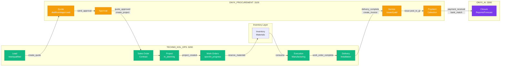
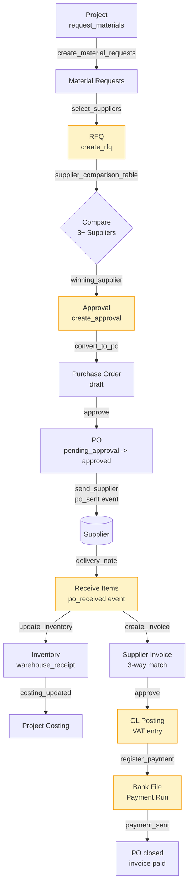
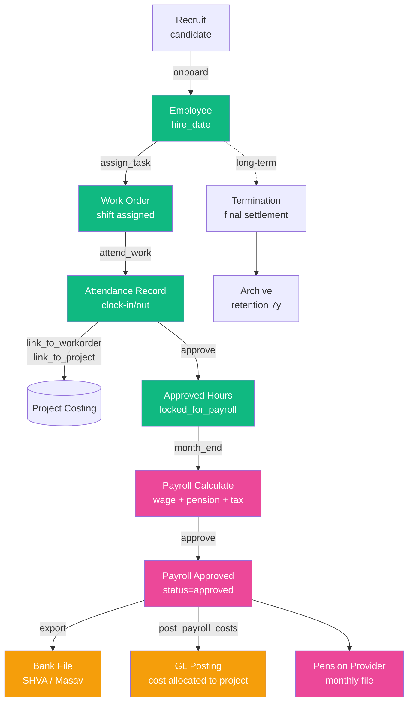
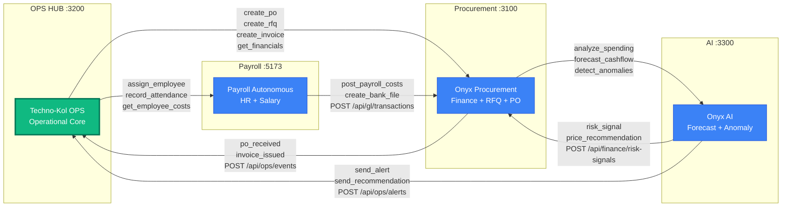

# AGENT-267 — Architecture Data-Flow Diagrams

**Agent:** 267 (ARCH #2) | **Date:** 2026-04-29 | **Scope:** End-to-end data-flow for Techno-Kol Uzi ERP 2026.

Sources: `onyx-procurement/src/pipeline/{pipeline-engine,workflow-flows,wiring-spec}.js` — 13 stages, 5 flows, 7 cross-service contracts. Each section has Mermaid + ASCII fallback. Diagrams reflect the *as-coded* truth.

---

## 1. Lead → Cash (Order-to-Cash, full pipeline)

This is the system's master flow: 13 stages from initial lead capture to closure, spanning all 4 services.

### Mermaid



### ASCII Fallback

```
                        LEAD-TO-CASH MASTER FLOW (13 stages)
                        =====================================

  [OPS:3200]                    [PROC:3100]                  [PROC:3100]
  +--------+   create_quote   +-------+   send_approval   +----------+
  |  LEAD  |----------------->| QUOTE |------------------>| APPROVAL |
  +--------+                  +-------+                   +----------+
                                                               |
                                                  quote_approved
                                                  create_project
                                                               v
  [OPS:3200]                    [OPS:3200]                  [OPS:3200]
  +----------+   project_     +---------+   create_      +--------------+
  | DELIVERY |<--workorder_   | PROJECT |--workorders--->| WORK ORDERS  |
  +----------+   complete     +---------+   _created     +--------------+
       ^                                                       |
       |                                                       | reserve
       | execution                                             v
  +-------------+                                       +-------------+
  | EXECUTION   |<--consume--+                          |  INVENTORY  |
  | (Manufact.) |            +--------------------------|  Materials  |
  +-------------+              po_received              +-------------+
                                update_inventory               ^
                                                               |  po_received
       |                                                       |
       v                                                       |
  [PROC:3100]                   [PROC:3100]              [PROC:3100]
  +---------+   issue        +---------+   payment_      +-----------+
  | INVOICE |--post_to_gl--->| PAYMENT |---received----->| CLOSURE   |
  | _issued |   post_to_vat  | bank_   |   bank_match    | (AI:3300) |
  +---------+                | matching|                 +-----------+
                             +---------+
```

**Stage owners (from `pipeline-engine.js` PIPELINE_STAGES):**
| Stage | Service | Color |
|-------|---------|-------|
| lead, order, project, work_orders, inventory, execution, delivery | ops | green family |
| quote, approval, procurement, invoice, payment | procurement | amber/red |
| closure | ai | purple |

---

## 2. Procurement P2P (Purchase-to-Pay)

Driven by `workflow-flows.js → project_to_procurement` and `procurement_to_execution`. RFQ comparison, PO emission, goods receipt, supplier invoice, payment.

### Mermaid



### ASCII Fallback

```
            PROCUREMENT P2P (Purchase-to-Pay)
            ==================================

   PROJECT ----request_materials----> MATERIAL REQUESTS
                                              |
                                              | select_suppliers
                                              v
                                          +-------+
                                          |  RFQ  |---send to N suppliers
                                          +-------+
                                              |
                                              | supplier_comparison
                                              v
                                          [ COMPARE ]
                                              |
                                       winning_supplier
                                              |
                                              v
                                       +----------+
                                       | APPROVAL |
                                       +----------+
                                              |
                                       convert_to_po
                                              |
                                              v
   +-----------+  approve   +------------+  send_supplier   +----------+
   | PO draft  |----------->| PO approved|----------------->| SUPPLIER |
   +-----------+            +------------+   po_sent event  +----------+
                                                                  |
                                                                  | delivery
                                                                  v
   +----------------+    update_inventory    +-------------------+
   | INVENTORY      |<-----------------------| RECEIVE ITEMS     |
   | warehouse_recv |    po_received event   | 3-way match       |
   +----------------+                        +-------------------+
          |                                          |
          | costing                                  | create_invoice
          v                                          v
   PROJECT COSTING                          +------------------+
                                            | SUPPLIER INVOICE |
                                            +------------------+
                                                     |
                                                     | post_to_gl + vat
                                                     v
                                            +----------------+
                                            | PAYMENT RUN    |
                                            | bank_file      |
                                            +----------------+
                                                     |
                                                     v
                                              [ PO closed ]
```

**State transitions (from `state-machines.js` po):**
`draft → pending_approval → approved → sent → partially_received → fully_received → closed`

---

## 3. HR Hire-to-Retire

Built from `workflow-flows.js → employee_to_payroll` plus `entity-map.js` employee links. Tracks the worker lifecycle with cost allocation back to projects.

### Mermaid



### ASCII Fallback

```
              HIRE-TO-RETIRE LIFECYCLE
              =========================

   [Recruit] --> [Hire] --> [Onboard]
                    |
                    v
              +----------+
              | EMPLOYEE |
              +----------+
                    |
                    | assign_task
                    v
              +-------------+      attend_work     +-------------+
              | WORK ORDER  |<-------------------->| ATTENDANCE  |
              +-------------+   link_to_project    +-------------+
                                                          |
                                                          | approve
                                                          v
                                                  [Locked for payroll]
                                                          |
                                                          | month_end
                                                          v
                                                  +------------------+
                                                  | PAYROLL CALC     |
                                                  | wage + pension   |
                                                  | + tax + expenses |
                                                  +------------------+
                                                          |
                              +---------------------------+---------------------------+
                              |                           |                           |
                              v                           v                           v
                       +-------------+            +--------------+           +-------------+
                       | BANK FILE   |            | GL POSTING   |           | PENSION FILE|
                       | SHVA/Masav  |            | cost->project|           | provider    |
                       +-------------+            +--------------+           +-------------+

                                            [...long-term...]
                                                     |
                                                     v
                                           +-----------------+
                                           | TERMINATION     |
                                           | final_settlement|
                                           +-----------------+
                                                     |
                                                     v
                                              [Archive 7y]
```

**Cross-service touchpoints:**
- ops → payroll: `assign_employee`, `record_attendance`
- payroll → procurement: `post_payroll_costs`, `create_bank_file`
- payroll status: `draft → calculated → approved → exported → paid`

---

## 4. Cross-Service Event Topology

Hub-and-spoke with **OPS as the core**. Built from `wiring-spec.js → CROSS_SERVICE_CONTRACTS` (7 contracts) and `pipeline-engine.js → SERVICE_TOPOLOGY`.

### Mermaid



### ASCII Fallback

```
                 CROSS-SERVICE EVENT TOPOLOGY (Hub-and-Spoke)
                 =============================================

                          +----------------------+
                          |    ONYX_AI :3300     |
                          | forecast / anomaly   |
                          +----------------------+
                              ^         |    ^
                              |         |    | risk_signal
            analyze_spending  |         |    | price_rec
            forecast_cashflow |  send_  |    |
            detect_anomalies  |  alert  |    |
                              |  send_  |    |
                              |  rec    |    |
                              |         v    |
   +-----------------+        |   +----------+         +----------------+
   | ONYX_PROCURE-   |<-------+   |          |-------->| ONYX_PROCURE-  |
   | MENT :3100      |            |          |         | MENT :3100     |
   |                 |            |          |         | (risk recv)    |
   +-----------------+            |          |         +----------------+
        ^   |                     |   OPS    |
        |   | create_po           |  HUB     |
        |   | create_rfq          |  :3200   |
   po_  |   | create_invoice      |          |
   recv'd  |  get_financials      |          |
   inv_    |                      |          |
   issued  v                      |          |
   +-----------------+            |          |         +----------------+
   | ONYX_PROCURE-   |----------->|          |<--------| PAYROLL_AUTO-  |
   | MENT :3100      |            |          |         | NOMOUS :5173   |
   | (events->ops)   |            +----------+         | (served /pay)  |
   +-----------------+                  ^   |          +----------------+
        ^                               |   |               ^
        |                               |   | assign_emp    |
        | post_payroll_costs            |   | rec_atten     |
        | create_bank_file              |   | get_costs     |
        |                               |   v               |
        +-------------------------------+--->----------------+
                                        |
                          7 Cross-Service Contracts:
                          --------------------------
                          1. ops -> procurement     (4 calls)
                          2. ops -> payroll         (3 calls)
                          3. procurement -> ops     (2 events)
                          4. procurement -> ai      (3 calls)
                          5. payroll -> procurement (2 calls)
                          6. ai -> ops              (2 calls)
                          7. ai -> procurement      (2 calls)
                          ===========================
                          Total: 18 cross-service endpoints
```

### Contract summary (from `CROSS_SERVICE_CONTRACTS`)

| From | To | Endpoints | Direction |
|------|-----|----------|-----------|
| ops | procurement | `POST /api/purchase-orders`, `POST /api/rfq/send`, `POST /api/invoices`, `GET /api/analytics/project-financials/:id` | sync RPC |
| ops | payroll | `POST /api/payroll/assignments`, `POST /api/payroll/attendance`, `GET /api/payroll/employee-costs/:id` | sync RPC |
| procurement | ops | `POST /api/ops/events` (po_received, invoice_issued) | event push |
| procurement | ai | `POST /api/ai/analyze`, `POST /api/ai/forecast`, `POST /api/ai/anomaly` | sync RPC |
| payroll | procurement | `POST /api/gl/transactions`, `POST /api/bank/import-payroll` | sync RPC |
| ai | ops | `POST /api/ops/alerts`, `POST /api/ops/recommendations` | event push |
| ai | procurement | `POST /api/finance/risk-signals`, `POST /api/pricing/recommendations` | event push |

---

## Key Findings

1. **Single source of truth.** Pipeline engine, workflow flows, and wiring spec are coherent — 13 stages / 5 flows / 7 contracts align. Diagrams are rendered directly from these.
2. **Hub topology is real.** OPS is the only service every other service both calls into and emits to. Procurement, Payroll, and AI rarely talk peer-to-peer.
3. **Event seam.** All `procurement→ops` traffic funnels through `POST /api/ops/events` with a typed event field — OPS is the event-bus consumer. Other directions are sync RPC.
4. **Inventory lives in OPS** but is read by Procurement at PO receipt — implies shared schema / read-replica not explicit in contracts.
5. **Cost loop closure.** `payroll → procurement (post_payroll_costs)` is what makes project profitability computable. Critical wire.
6. **Closure owned by AI.** The final reporting/forecasting stage is `service: 'ai'`, not OPS — Diagram 1 reflects this.

## Source Files

- `onyx-procurement/src/pipeline/pipeline-engine.js` (568 lines — 13 stages, 11 event triggers, topology)
- `onyx-procurement/src/pipeline/workflow-flows.js` (130 lines — 5 flows)
- `onyx-procurement/src/pipeline/wiring-spec.js` (333 lines — 7 cross-service contracts)
- `onyx-procurement/src/pipeline/state-machines.js`, `entity-map.js` (referenced for transitions/links)
