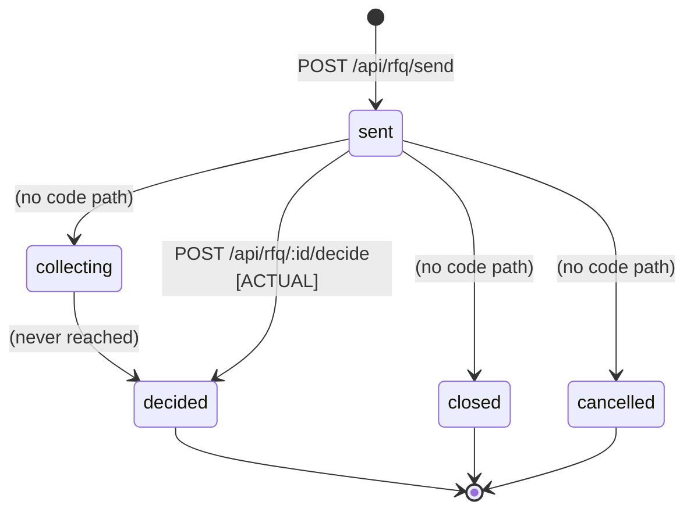
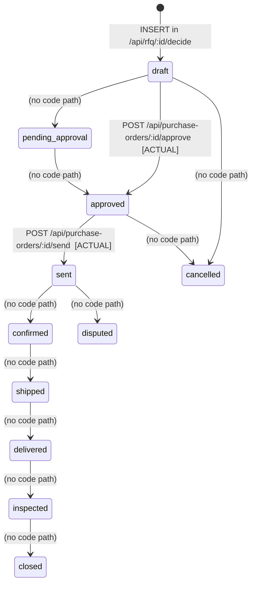
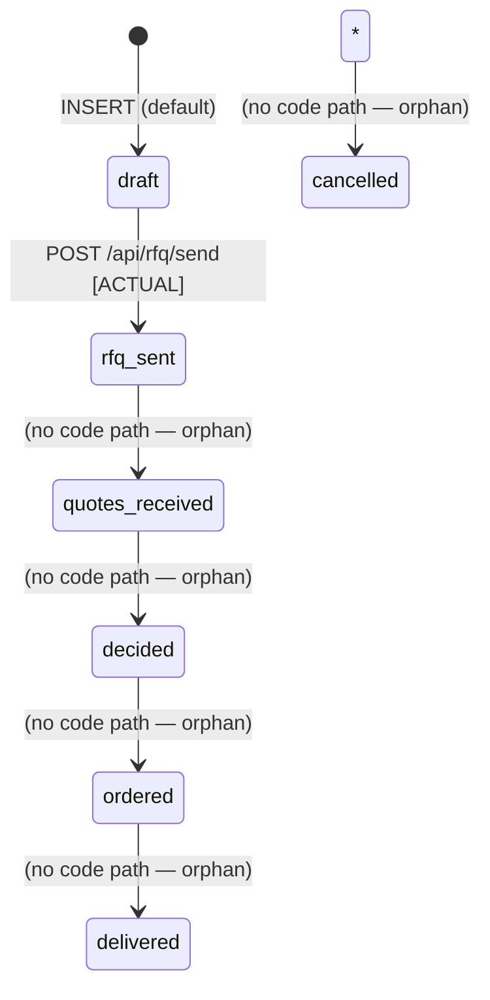
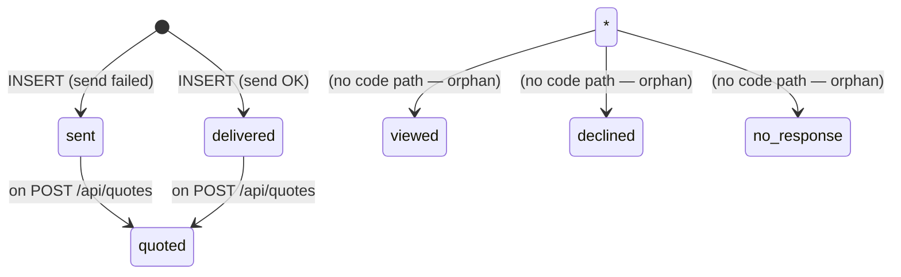

# QA Agent #37 — Business Logic State Machine Validation

**Date:** 2026-04-11
**Dimension:** Business Logic / State Machine Validation
**Scope:** RFQ, Purchase Order, Purchase Request, Subcontractor Decision, RFQ Recipients
**Method:** Static analysis of `server.js` transitions vs DB `CHECK` constraints

---

## 1. State Machines — Enumerated from Schema

### 1.1 `purchase_requests.status`
DB CHECK (line 90):
```
draft, rfq_sent, quotes_received, decided, ordered, delivered, cancelled
```
Used in code only via `POST /api/rfq/send` → `update status = 'rfq_sent'` (line 324). No other transition in code.

### 1.2 `rfqs.status`
DB CHECK (line 123):
```
sent, collecting, decided, closed, cancelled
```
Used in code:
- `INSERT` with `status = 'sent'` (line 284)
- `UPDATE` to `status = 'decided'` (line 573, inside `/api/rfq/:id/decide`)

### 1.3 `rfq_recipients.status`
DB CHECK (line 140):
```
sent, delivered, viewed, quoted, declined, no_response
```
Used in code:
- `INSERT` with `status = 'delivered'` if send OK, else `'sent'` (line 311)
- `UPDATE` to `'quoted'` upon quote insert (line 397)

### 1.4 `purchase_orders.status`
DB CHECK (line 211):
```
draft, pending_approval, approved, sent, confirmed, shipped, delivered, inspected, closed, cancelled, disputed
```
Used in code:
- `INSERT` with `status = 'draft'` (line 535, after decide)
- `UPDATE` to `'approved'` (line 616, `/approve` endpoint)
- `UPDATE` to `'sent'` (line 668, `/send` endpoint) — even on failure (F-02 known)

### 1.5 `subcontractor_decisions` — no status column
There is **no** `status` column on `subcontractor_decisions`. Only `work_order_sent BOOLEAN` and `sent_at`. This means a decision cannot be "draft", "locked", "cancelled" — once inserted, it is immutable by design, but no audit or versioning exists.

---

## 2. State Diagram (Intended vs Implemented)

### 2.1 RFQ — Intended full lifecycle

**What code actually implements:** `sent → decided`. `collecting`, `closed`, `cancelled` are **orphan states** in the schema — declared but never assigned.

### 2.2 Purchase Order — Intended full lifecycle

**What code actually implements:** `draft → approved → sent`. Nothing past `sent` ever gets set. `confirmed`, `shipped`, `delivered`, `inspected`, `closed`, `cancelled`, `disputed` are **orphan states**.

### 2.3 Purchase Request — Orphan pipeline

Only ONE transition is wired up (`draft → rfq_sent`). The rest of the lifecycle is dead.

### 2.4 RFQ Recipient


---

## 3. Findings

### S-01 · Orphan states — schema promises more than code delivers
**Severity:** HIGH
**Location:** `001-supabase-schema.sql` vs `server.js`

Orphan states per entity:
| Entity | Declared states | Used in code | Orphaned |
|--------|-----------------|--------------|----------|
| `rfqs.status` | 5 | 2 (`sent`, `decided`) | `collecting`, `closed`, `cancelled` |
| `purchase_orders.status` | 11 | 4 (`draft`, `approved`, `sent`, + filter by closed/cancelled/delivered) | `pending_approval`, `confirmed`, `shipped`, `delivered`, `inspected`, `closed`, `cancelled`, `disputed` |
| `purchase_requests.status` | 7 | 2 (`draft`, `rfq_sent`) | `quotes_received`, `decided`, `ordered`, `delivered`, `cancelled` |
| `rfq_recipients.status` | 6 | 3 (`sent`, `delivered`, `quoted`) | `viewed`, `declined`, `no_response` |

**Impact:** Views that count by these statuses (e.g. `procurement_dashboard` at line 480 filters `status NOT IN ('closed','cancelled','delivered')`) will NEVER filter anything out — counters will perpetually climb. KPIs are meaningless.

**Fix:** Either wire up transitions (`/confirm`, `/ship`, `/deliver`, `/close`, `/cancel` endpoints), or remove the orphan states from the `CHECK` constraint and the dashboard views.

---

### S-02 · No state-transition validation — illegal jumps allowed
**Severity:** HIGH (correctness)
**Locations:** `server.js:616`, `server.js:668`, `server.js:573`

All `UPDATE ... status = X` calls blindly overwrite the status with no `WHERE status = <expected>` guard.

Examples of illegal moves that the code accepts:
1. `POST /api/purchase-orders/:id/approve` on a PO already `sent` → **moves it backwards to `approved`**, losing `sent_at`.
2. `POST /api/purchase-orders/:id/send` on a `draft` PO (not yet approved) → jumps `draft → sent`, **bypassing approval**.
3. `POST /api/purchase-orders/:id/send` on an already-`sent` PO → re-sends and overwrites `sent_at`, effectively **duplicate dispatch**.
4. `POST /api/rfq/:id/decide` on an already-`decided` RFQ → creates a **second PO** for the same RFQ; the old PO is orphaned with no link back.
5. `POST /api/purchase-orders/:id/approve` after the PO was `cancelled`/`closed` → resurrects a closed PO silently.

DB `CHECK` constraints only validate the **final value**, not that the transition is legal. Postgres has no native state-machine enforcement unless you add a trigger.

**Recommended guard (example for approve):**
```js
.update({ status: 'approved', ... })
.eq('id', req.params.id)
.in('status', ['draft', 'pending_approval'])   // allowed predecessors
.select().single();
// if .data is null → 409 Conflict "illegal transition"
```

---

### S-03 · `/approve` endpoint bypasses `pending_approval` state entirely
**Severity:** MEDIUM
**Location:** `server.js:614-623`

`purchase_orders` schema defines `pending_approval` as a legal state, and `procurement_dashboard` counts `pending_approval` POs (line 485). But the code path `draft → approved` skips it. No endpoint ever sets `pending_approval`. So the dashboard KPI "pending_approvals" is **always 0**.

This contradicts the declared business intent that POs should queue for approval.

**Fix options:**
- (a) On `/decide`, set PO `status = 'pending_approval'` instead of `'draft'`, then approve transitions to `'approved'`.
- (b) Add a separate `/submit-for-approval` endpoint.

---

### S-04 · `/send` endpoint does not require `approved` state
**Severity:** HIGH (financial)
**Location:** `server.js:626-679`

`POST /api/purchase-orders/:id/send` reads the PO, builds the WhatsApp message and blindly updates `status='sent'`. It never checks `po.status === 'approved'`. A PO in `draft` state can be dispatched to a supplier without any human approval. Combined with **B-03 no auth**, anyone who can reach the API can skip approval entirely.

**Fix:** `if (po.status !== 'approved') return res.status(409).json({ error: 'PO must be approved before sending' });`

---

### S-05 · No `cancel` / `close` / `dispute` endpoints exist at all
**Severity:** HIGH
**Location:** `server.js` (whole file)

Search confirmed: no endpoint sets `status = 'cancelled'`, `'closed'`, `'disputed'`, `'confirmed'`, `'shipped'`, `'delivered'`, or `'inspected'`. Meaning: once a PO reaches `sent`, it is **stuck there forever**. There is no way to:
- mark it delivered
- close the order after receipt
- cancel a rogue PO
- register a dispute with the supplier

`delivery_reliability`, `on_time_delivery_rate` and `quality_score` columns exist but are never written to through an endpoint, because no endpoint represents the receive/inspect flow.

**Impact:** The system can open procurement but cannot close it. Analytics on delivery performance are stubs.

---

### S-06 · `rfq.status = 'collecting'` is declared but unreachable
**Severity:** MEDIUM
**Location:** `server.js:284` and `001-supabase-schema.sql:484`

RFQ is inserted with `status='sent'`. There is no code path that ever moves it to `'collecting'`, despite the `procurement_dashboard` view (line 484) counting `status IN ('sent', 'collecting')` as "open rfqs". The `collecting` branch is dead.

The intended logic (sent → collecting once 1st quote arrives → decided once threshold reached) is missing.

**Fix:** On `POST /api/quotes`, update parent RFQ from `'sent'` → `'collecting'`.

---

### S-07 · `auto_close_on_deadline` column has no code that acts on it
**Severity:** HIGH
**Location:** `001-supabase-schema.sql:122` — column `auto_close_on_deadline BOOLEAN DEFAULT true`; `response_deadline TIMESTAMPTZ NOT NULL` (line 118)

The schema declares that RFQs should auto-close on deadline and carries a `response_deadline`. Code has:
- `server.js:255` — computes `deadline = now + response_window_hours * 3600000` and stores it
- **Zero** scheduled jobs, cron, triggers or polling. No code ever reads `response_deadline` to close stale RFQs.

**Impact:** RFQs will sit with `status='sent'` forever. Suppliers can submit quotes a year late. The "open rfqs" KPI will monotonically grow.

**Fix:** Add a scheduled worker (Supabase `pg_cron`, or external scheduler) that runs periodically and `UPDATE rfqs SET status='closed' WHERE status='sent' AND response_deadline < NOW()`.

---

### S-08 · `reminder_after_hours` / `reminder_sent` are dead fields
**Severity:** MEDIUM
**Location:** `001-supabase-schema.sql:120, 138-139`

`rfqs.reminder_after_hours INTEGER DEFAULT 12`, `rfq_recipients.reminder_sent BOOLEAN`, `reminder_sent_at TIMESTAMPTZ` — all three exist, none are ever read or written by code. Promised business rule (send reminder 12 hours before deadline) is not implemented.

---

### S-09 · `min_quotes_before_decision` declared but unenforced
**Severity:** MEDIUM
**Location:** `001-supabase-schema.sql:121`; `server.js:443`

Schema: `min_quotes_before_decision INTEGER DEFAULT 2`.
Code: `if (!quotes || quotes.length < 1) return 400` — gate is **hardcoded to `< 1`**, not the RFQ's configured threshold. So a decision can be made on 1 quote even when the RFQ promised "wait for at least 2".

**Fix:** Read `rfq.min_quotes_before_decision` and enforce `quotes.length >= rfq.min_quotes_before_decision`.

---

### S-10 · F-02 expanded — PO `status=sent` is not idempotent and ignores send result
**Severity:** HIGH (extension of existing F-02)
**Location:** `server.js:663-670`

Expanding on F-02 (known finding):
1. **Idempotency:** `POST /send` has no idempotency key. If client retries (e.g. network blip), WhatsApp is called twice; two messages go out; `sent_at` is overwritten to the second call. Supplier receives duplicate order, possibly fulfills both.
2. **Silent success on no-op:** If `WA_TOKEN` or `address` is missing, the `if (WA_TOKEN && address)` branch is skipped, `sendResult` stays `{success:false}`, but the code still updates `status='sent'`. The PO is marked "sent" though nothing was actually sent. The user sees green check in the dashboard.
3. **No retry policy:** Transient WhatsApp errors (429, 503) are treated as permanent failure — but status is still marked "sent". No backoff, no dead-letter queue.
4. **Audit log logs success before confirming:** `audit()` is called after the update, so it records "PO sent to X via WhatsApp" even when sendResult.success === false.

**Fix (suggested):**
```js
if (!sendResult.success) {
  await audit('purchase_order', po.id, 'send_failed', ..., sendResult.error);
  return res.status(502).json({ sent: false, error: 'WhatsApp send failed' });
}
await supabase.from('purchase_orders').update({ status: 'sent', sent_at: ..., wa_message_id: sendResult.messageId })
  .eq('id', po.id).eq('status', 'approved');  // only if still approved
```
Plus an idempotency token (client-sent `X-Idempotency-Key`) to prevent double-send.

---

### S-11 · State + actor pairing — nobody is authorized to anything
**Severity:** CRITICAL (tied to B-03)
**Location:** `server.js` entire file

Every state-mutating endpoint accepts `req.body.approved_by` / `decided_by` / `sent_by` as **plain strings** and writes them to audit. No verification that:
- the declared actor is a real user,
- the actor has role/permission to perform this transition,
- `approved_by !== requested_by` (segregation of duties).

A requester can approve their own PO. A junior staff member can send POs for millions. An external attacker (per B-03) can approve any PO by POSTing `{approved_by: "god"}`.

**Fix (incremental):**
1. Add `roles` table + `user_id` column to POs.
2. Require JWT/API key (per B-03).
3. Enforce RBAC at endpoint level: `requireRole('manager')` on `/approve`.
4. Enforce segregation: `if (po.requested_by === auth.user.id) return 403`.

---

### S-12 · No time-based transitions anywhere
**Severity:** HIGH
**Locations:** none (absence)

No cron jobs, no scheduled workers, no Supabase `pg_cron` triggers. Consequence:
- RFQs never auto-close on deadline (S-07)
- Reminders never fire (S-08)
- POs never auto-expire if supplier doesn't confirm
- Quotes never expire even though `valid_for_days INTEGER DEFAULT 14` is in the schema (line 162)
- Overdue deliveries are never flagged (`expected_delivery` is set, never checked)

**Fix:** Either run a periodic Node cron (`node-cron`) that hits internal endpoints, or set up `pg_cron` in Supabase.

---

### S-13 · Audit log is not a state-transition log
**Severity:** MEDIUM
**Location:** `server.js:99-105` (audit helper) + all call sites

`audit_log` columns `previous_value JSONB` / `new_value JSONB` are defined, and the helper function accepts `prev, next`. Call sites:
- `POST /api/suppliers` — passes no prev/next (only supplier name) → NULL
- `PATCH /api/suppliers/:id` — passes prev/next ✓ (line 161)
- `POST /api/rfq/send` — no prev/next (line 326)
- `POST /api/quotes` — no prev/next (line 412)
- `POST /api/rfq/:id/decide` — no prev/next (line 582)
- `POST /api/purchase-orders/:id/approve` — no prev/next (line 621)
- `POST /api/purchase-orders/:id/send` — no prev/next (line 672)
- `POST /api/subcontractors/decide` — **no audit call at all** (lines 712-798)

**Impact:** Auditor cannot reconstruct "who moved this PO from approved → sent at time T". Only the action name is logged. The `previous_value`/`new_value` columns exist but are 95% NULL.

**Fix:** Always pass `prev = po_before_update`, `next = po_after_update`. And add `audit('subcontractor_decision', ...)` to the decide endpoint.

---

### S-14 · Subcontractor decision has no state and no lock
**Severity:** HIGH
**Location:** `server.js:712-798`, `001-supabase-schema.sql:314-334`

`subcontractor_decisions` has no `status` column. The decision is written as final on first call. There is no:
- `draft` phase where the decision can be revised
- `locked` / `confirmed` phase where the decision becomes binding
- `cancelled` path if the project falls through
- `sent_at` writes (column exists at line 331 but never written — `work_order_sent` is always the default `false`)
- `decision_id` idempotency (two rapid calls create two rows with identical inputs)

A caller can submit the same `(project_name, work_type)` twice and end up with two `selected_subcontractor` rows. Nothing detects conflict.

**Fix:**
1. Add `status TEXT CHECK (status IN ('draft','locked','cancelled'))`.
2. Add unique constraint `(project_id, work_type) WHERE status='locked'`.
3. Add `/lock` and `/cancel` endpoints.

---

### S-15 · No state for `quotes` — cannot reject or expire a quote
**Severity:** MEDIUM
**Location:** `001-supabase-schema.sql:149-167`

`supplier_quotes` has no `status` column. Once inserted, a quote is always "live". No way to:
- Reject a quote before decision
- Mark a quote as expired when `valid_for_days` passes
- Mark a quote as "superseded" when supplier sends a revised version

The only related field is `rfq_recipients.status='quoted'`, which only tracks whether the supplier sent any quote — not which one is active.

**Fix:** Add `status TEXT CHECK (status IN ('active','rejected','expired','superseded'))`.

---

### S-16 · Implicit state drift — `purchase_requests` is orphaned after `rfq_sent`
**Severity:** MEDIUM
**Location:** `server.js:324`

The only code that writes `purchase_requests.status` is line 324: `update({ status: 'rfq_sent' })`. Beyond that:
- `/decide` never moves it to `'decided'`
- `/approve` never moves it to `'ordered'`
- `/send` never moves it to `'ordered'` either
- Delivery never reaches `'delivered'`

So the PR "status" column is a half-baked feed — useful only to say "an RFQ has been dispatched", not the full lifecycle. Dashboard KPIs that filter PRs by status will mislead.

---

### S-17 · No compensating transactions
**Severity:** HIGH
**Location:** many multi-step endpoints

`/api/rfq/:id/decide` does:
1. `INSERT purchase_orders`
2. `INSERT po_line_items` (batch)
3. `INSERT procurement_decisions`
4. `UPDATE rfqs SET status='decided'`
5. `UPDATE suppliers SET total_orders += 1`

If step 3 fails (e.g. JSON too big, FK missing), steps 1-2 persist. The PO is created but no `procurement_decisions` row links it to the RFQ. The RFQ stays `'sent'`. Supplier stats are incorrect.

There is no `BEGIN TRANSACTION` / rollback anywhere. Supabase's REST client does not automatically wrap multi-call flows in a transaction.

**Fix:** Wrap into a Postgres RPC (`CREATE FUNCTION decide_rfq(...) RETURNS ...` that runs everything atomically), or implement manual cleanup on failure.

---

## 4. Severity Summary

| ID | Finding | Severity |
|----|---------|----------|
| S-01 | 18 orphan states across 4 tables | HIGH |
| S-02 | No state-transition guards (illegal jumps allowed) | HIGH |
| S-03 | `pending_approval` state is dead | MEDIUM |
| S-04 | `/send` doesn't require `approved` status | HIGH |
| S-05 | No cancel/close/dispute endpoints | HIGH |
| S-06 | `collecting` state unreachable | MEDIUM |
| S-07 | `auto_close_on_deadline` unimplemented | HIGH |
| S-08 | `reminder_after_hours` unimplemented | MEDIUM |
| S-09 | `min_quotes_before_decision` unenforced | MEDIUM |
| S-10 | F-02 expanded — PO send is non-idempotent, mis-reports success | HIGH |
| S-11 | No actor/role check on transitions | CRITICAL |
| S-12 | No time-based transitions (cron/pg_cron) | HIGH |
| S-13 | Audit log misses prev/next 95% of the time; no sub audit | MEDIUM |
| S-14 | Subcontractor decision has no state, no lock, no idempotency | HIGH |
| S-15 | Quotes have no status (can't reject/expire/supersede) | MEDIUM |
| S-16 | `purchase_requests` status lifecycle is half-wired | MEDIUM |
| S-17 | No compensating transactions on multi-step writes | HIGH |

**Total:** 17 state-machine issues
- CRITICAL: 1
- HIGH: 9
- MEDIUM: 7

---

## 5. Recommended Fixes — Priority Order

1. **S-11 / S-04** (same fix) — add API-key middleware + role check; enforce `/send` requires `approved`.
2. **S-02** — add `.in('status', [allowed_predecessors])` guard to every `UPDATE status=...` call. This alone closes 5 attack vectors.
3. **S-17** — convert `/decide` into a Postgres RPC that runs atomically.
4. **S-07** — add `pg_cron` job: `UPDATE rfqs SET status='closed' WHERE status='sent' AND response_deadline < now()`.
5. **S-14** — add `status` column to `subcontractor_decisions` and unique constraint on `(project_id, work_type)`.
6. **S-05** — add 3 endpoints: `/cancel`, `/close`, `/dispute`. Even if they're just simple status bumps, at least the state graph is closable.
7. **S-01** — audit the orphan states; either wire them up or prune the `CHECK` list to match reality.
8. **S-13** — replace every `audit()` call that doesn't pass `prev/next` with one that does.

---

## 6. Suggested Postgres trigger (enforcement at DB level)

Since Supabase calls don't go through an ORM, the safest belt-and-braces is a DB-level transition guard:

```sql
CREATE OR REPLACE FUNCTION check_po_transition()
RETURNS TRIGGER AS $$
BEGIN
  IF OLD.status = 'cancelled' OR OLD.status = 'closed' THEN
    RAISE EXCEPTION 'Cannot modify PO in status %', OLD.status;
  END IF;
  IF OLD.status = 'draft' AND NEW.status NOT IN ('pending_approval','approved','cancelled') THEN
    RAISE EXCEPTION 'Illegal PO transition: % -> %', OLD.status, NEW.status;
  END IF;
  IF OLD.status = 'approved' AND NEW.status NOT IN ('sent','cancelled') THEN
    RAISE EXCEPTION 'Illegal PO transition: % -> %', OLD.status, NEW.status;
  END IF;
  IF OLD.status = 'sent' AND NEW.status NOT IN ('confirmed','cancelled','disputed') THEN
    RAISE EXCEPTION 'Illegal PO transition: % -> %', OLD.status, NEW.status;
  END IF;
  -- ...etc
  RETURN NEW;
END;
$$ LANGUAGE plpgsql;

CREATE TRIGGER trg_po_transition_guard
  BEFORE UPDATE OF status ON purchase_orders
  FOR EACH ROW
  WHEN (OLD.status IS DISTINCT FROM NEW.status)
  EXECUTE FUNCTION check_po_transition();
```

Same pattern for `rfqs`, `purchase_requests`, `subcontractor_decisions`.

---

**End of QA Agent #37 report.**
