# ONYX — Database Schema Reference

> Auto-generated by `scripts/docs/gen-schema-docs.js`.
> Do not edit by hand — run `npm run docs:schema` after any migration change.

- **Generated:** 2026-04-11T11:45:25.368Z
- **Source files:** 8
- **Tables:** 40
- **Views:** 5
- **Indexes:** 64
- **Foreign keys:** 41

## Source Files

- `supabase/migrations/000-bootstrap-pg-execute.sql`
- `supabase/migrations/001-supabase-schema.sql`
- `supabase/migrations/002-seed-data-extended.sql`
- `supabase/migrations/003-migration-tracking-and-precision.sql`
- `supabase/migrations/004-vat-module.sql`
- `supabase/migrations/005-annual-tax-module.sql`
- `supabase/migrations/006-bank-reconciliation.sql`
- `supabase/migrations/007-payroll-wage-slip.sql`

## Tables Overview

| # | Table | Columns | Indexes | Module | Description |
|---|-------|---------|---------|--------|-------------|
| 1 | [`annual_tax_reports`](#annual_tax_reports) | 15 | 2 | 005-annual-tax-module |  |
| 2 | [`audit_log`](#audit_log) | 9 | 4 | 001-supabase-schema |  |
| 3 | [`bank_accounts`](#bank_accounts) | 18 | 1 | 006-bank-reconciliation |  |
| 4 | [`bank_statements`](#bank_statements) | 15 | 1 | 006-bank-reconciliation |  |
| 5 | [`bank_transactions`](#bank_transactions) | 22 | 4 | 006-bank-reconciliation |  |
| 6 | [`chart_of_accounts`](#chart_of_accounts) | 11 | 1 | 005-annual-tax-module |  |
| 7 | [`company_tax_profile`](#company_tax_profile) | 40 | 0 | 004-vat-module | Legal entity tax identity — required for VAT/Annual tax reports |
| 8 | [`customer_invoices`](#customer_invoices) | 25 | 4 | 005-annual-tax-module |  |
| 9 | [`customer_payments`](#customer_payments) | 17 | 3 | 005-annual-tax-module |  |
| 10 | [`customers`](#customers) | 16 | 1 | 005-annual-tax-module |  |
| 11 | [`employee_balances`](#employee_balances) | 13 | 0 | 007-payroll-wage-slip |  |
| 12 | [`employees`](#employees) | 28 | 1 | 007-payroll-wage-slip |  |
| 13 | [`employers`](#employers) | 12 | 0 | 007-payroll-wage-slip |  |
| 14 | [`fiscal_years`](#fiscal_years) | 15 | 0 | 005-annual-tax-module |  |
| 15 | [`notifications`](#notifications) | 14 | 2 | 001-supabase-schema |  |
| 16 | [`payroll_audit_log`](#payroll_audit_log) | 12 | 3 | 007-payroll-wage-slip |  |
| 17 | [`po_line_items`](#po_line_items) | 14 | 1 | 001-supabase-schema |  |
| 18 | [`price_history`](#price_history) | 9 | 2 | 001-supabase-schema |  |
| 19 | [`procurement_decisions`](#procurement_decisions) | 14 | 0 | 001-supabase-schema |  |
| 20 | [`projects`](#projects) | 21 | 3 | 005-annual-tax-module |  |
| 21 | [`purchase_orders`](#purchase_orders) | 32 | 3 | 001-supabase-schema |  |
| 22 | [`purchase_request_items`](#purchase_request_items) | 10 | 1 | 001-supabase-schema |  |
| 23 | [`purchase_requests`](#purchase_requests) | 10 | 0 | 001-supabase-schema |  |
| 24 | [`quote_line_items`](#quote_line_items) | 11 | 1 | 001-supabase-schema |  |
| 25 | [`reconciliation_discrepancies`](#reconciliation_discrepancies) | 14 | 1 | 006-bank-reconciliation |  |
| 26 | [`reconciliation_matches`](#reconciliation_matches) | 15 | 2 | 006-bank-reconciliation |  |
| 27 | [`rfq_recipients`](#rfq_recipients) | 11 | 2 | 001-supabase-schema |  |
| 28 | [`rfqs`](#rfqs) | 11 | 0 | 001-supabase-schema |  |
| 29 | [`schema_migrations`](#schema_migrations) | 7 | 1 | 003-migration-tracking-and-precision | Tracks applied DB migrations. One row per migration file. B-14 fix (Wave 1.5). |
| 30 | [`subcontractor_decisions`](#subcontractor_decisions) | 19 | 0 | 001-supabase-schema |  |
| 31 | [`subcontractor_pricing`](#subcontractor_pricing) | 8 | 2 | 001-supabase-schema |  |
| 32 | [`subcontractors`](#subcontractors) | 15 | 0 | 001-supabase-schema |  |
| 33 | [`supplier_products`](#supplier_products) | 13 | 2 | 001-supabase-schema |  |
| 34 | [`supplier_quotes`](#supplier_quotes) | 17 | 2 | 001-supabase-schema |  |
| 35 | [`suppliers`](#suppliers) | 28 | 0 | 001-supabase-schema |  |
| 36 | [`system_events`](#system_events) | 8 | 2 | 001-supabase-schema |  |
| 37 | [`tax_invoices`](#tax_invoices) | 30 | 5 | 004-vat-module |  |
| 38 | [`vat_rates`](#vat_rates) | 7 | 0 | 003-migration-tracking-and-precision | Historical VAT rates with effective dates. B-05 fix. |
| 39 | [`vat_submissions`](#vat_submissions) | 15 | 2 | 004-vat-module |  |
| 40 | [`wage_slips`](#wage_slips) | 73 | 3 | 007-payroll-wage-slip |  |

## Entity-Relationship Diagram (Mermaid)

```mermaid
erDiagram
  SUPPLIERS ||--o{ SUPPLIER_PRODUCTS : "supplier_id"
  SUPPLIERS ||--o{ PRICE_HISTORY : "supplier_id"
  SUPPLIER_PRODUCTS ||--o{ PRICE_HISTORY : "product_id"
  PURCHASE_REQUESTS ||--o{ PURCHASE_REQUEST_ITEMS : "request_id"
  PURCHASE_REQUESTS ||--o{ RFQS : "purchase_request_id"
  RFQS ||--o{ RFQ_RECIPIENTS : "rfq_id"
  SUPPLIERS ||--o{ RFQ_RECIPIENTS : "supplier_id"
  RFQS ||--o{ SUPPLIER_QUOTES : "rfq_id"
  SUPPLIERS ||--o{ SUPPLIER_QUOTES : "supplier_id"
  SUPPLIER_QUOTES ||--o{ QUOTE_LINE_ITEMS : "quote_id"
  PURCHASE_REQUEST_ITEMS ||--o{ QUOTE_LINE_ITEMS : "item_id"
  RFQS ||--o{ PURCHASE_ORDERS : "rfq_id"
  SUPPLIERS ||--o{ PURCHASE_ORDERS : "supplier_id"
  PURCHASE_ORDERS ||--o{ PO_LINE_ITEMS : "po_id"
  RFQS ||--o{ PROCUREMENT_DECISIONS : "rfq_id"
  PURCHASE_REQUESTS ||--o{ PROCUREMENT_DECISIONS : "purchase_request_id"
  PURCHASE_ORDERS ||--o{ PROCUREMENT_DECISIONS : "purchase_order_id"
  SUPPLIERS ||--o{ PROCUREMENT_DECISIONS : "selected_supplier_id"
  SUBCONTRACTORS ||--o{ SUBCONTRACTOR_PRICING : "subcontractor_id"
  SUBCONTRACTORS ||--o{ SUBCONTRACTOR_DECISIONS : "selected_subcontractor_id"
  VAT_PERIODS ||--o{ TAX_INVOICES : "vat_period_id"
  VAT_PERIODS ||--o{ VAT_SUBMISSIONS : "vat_period_id"
  CUSTOMERS ||--o{ CUSTOMER_INVOICES : "customer_id"
  PROJECTS ||--o{ CUSTOMER_INVOICES : "project_id"
  TAX_INVOICES ||--o{ CUSTOMER_INVOICES : "linked_tax_invoice_id"
  CUSTOMERS ||--o{ CUSTOMER_PAYMENTS : "customer_id"
  CHART_OF_ACCOUNTS ||--o{ CHART_OF_ACCOUNTS : "parent_id"
  BANK_ACCOUNTS ||--o{ BANK_STATEMENTS : "bank_account_id"
  BANK_ACCOUNTS ||--o{ BANK_TRANSACTIONS : "bank_account_id"
  BANK_STATEMENTS ||--o{ BANK_TRANSACTIONS : "bank_statement_id"
  BANK_TRANSACTIONS ||--o{ RECONCILIATION_MATCHES : "bank_transaction_id"
  BANK_ACCOUNTS ||--o{ RECONCILIATION_DISCREPANCIES : "bank_account_id"
  BANK_STATEMENTS ||--o{ RECONCILIATION_DISCREPANCIES : "bank_statement_id"
  BANK_TRANSACTIONS ||--o{ RECONCILIATION_DISCREPANCIES : "bank_transaction_id"
  EMPLOYERS ||--o{ EMPLOYEES : "employer_id"
  EMPLOYEES ||--o{ WAGE_SLIPS : "employee_id"
  EMPLOYERS ||--o{ WAGE_SLIPS : "employer_id"
  WAGE_SLIPS ||--o{ WAGE_SLIPS : "amendment_of"
  EMPLOYEES ||--o{ EMPLOYEE_BALANCES : "employee_id"
  WAGE_SLIPS ||--o{ PAYROLL_AUDIT_LOG : "wage_slip_id"
  EMPLOYEES ||--o{ PAYROLL_AUDIT_LOG : "employee_id"
  SUPPLIERS {
    uuid id PK
    string name
    string contact_person
    string phone
    string email
    string whatsapp
    string address
    string country
    string preferred_channel
    string default_payment_terms
    int avg_delivery_days
    number distance_km
    string _more_16_fields
  }
  SUPPLIER_PRODUCTS {
    uuid id PK
    uuid supplier_id FK
    string category
    string name
    string description
    string sku
    number current_price
    string currency
    string unit
    number min_order_qty
    int lead_time_days
    datetime created_at
    string _more_1_fields
  }
  PRICE_HISTORY {
    uuid id PK
    uuid supplier_id FK
    uuid product_id FK
    string product_key
    number price
    string currency
    number quantity
    string source
    datetime recorded_at
  }
  PURCHASE_REQUESTS {
    uuid id PK
    string requested_by
    string urgency
    datetime required_by_date
    string project_id
    string project_name
    string notes
    string status
    datetime created_at
    datetime updated_at
  }
  PURCHASE_REQUEST_ITEMS {
    uuid id PK
    uuid request_id FK
    string category
    string name
    string description
    number quantity
    string unit
    string specs
    number max_budget
    datetime created_at
  }
  RFQS {
    uuid id PK
    uuid purchase_request_id FK
    string message_text
    datetime response_deadline
    int response_window_hours
    int reminder_after_hours
    int min_quotes_before_decision
    boolean auto_close_on_deadline
    string status
    datetime sent_at
    datetime created_at
  }
  RFQ_RECIPIENTS {
    uuid id PK
    uuid rfq_id FK
    uuid supplier_id FK
    string supplier_name
    string sent_via
    datetime sent_at
    boolean delivered
    boolean reminder_sent
    datetime reminder_sent_at
    string status
    datetime created_at
  }
  SUPPLIER_QUOTES {
    uuid id PK
    uuid rfq_id FK
    uuid supplier_id FK
    string supplier_name
    number total_price
    boolean vat_included
    number vat_amount
    number total_with_vat
    number delivery_fee
    boolean free_delivery
    int delivery_days
    string payment_terms
    string _more_5_fields
  }
  QUOTE_LINE_ITEMS {
    uuid id PK
    uuid quote_id FK
    uuid item_id FK
    string name
    number quantity
    string unit
    number unit_price
    number discount_percent
    number total_price
    int lead_time_days
    string notes
  }
  PURCHASE_ORDERS {
    uuid id PK
    uuid rfq_id FK
    uuid supplier_id FK
    string supplier_name
    number subtotal
    number delivery_fee
    number vat_amount
    number total
    string currency
    string payment_terms
    datetime expected_delivery
    string delivery_address
    string _more_20_fields
  }
  PO_LINE_ITEMS {
    uuid id PK
    uuid po_id FK
    string name
    string description
    string category
    number quantity
    string unit
    number unit_price
    number discount_percent
    number total_price
    int lead_time_days
    number market_price
    string _more_2_fields
  }
  PROCUREMENT_DECISIONS {
    uuid id PK
    uuid rfq_id FK
    uuid purchase_request_id FK
    uuid purchase_order_id FK
    uuid selected_supplier_id FK
    string selected_supplier_name
    number selected_total_cost
    number highest_cost
    number savings_amount
    number savings_percent
    json reasoning
    int quotes_compared
    string _more_2_fields
  }
  SUBCONTRACTORS {
    uuid id PK
    string name
    string phone
    string email
    string specialties
    number quality_rating
    number reliability_rating
    boolean available
    string notes
    int total_projects
    int completed_on_time
    number total_revenue
    string _more_3_fields
  }
  SUBCONTRACTOR_PRICING {
    uuid id PK
    uuid subcontractor_id FK
    string work_type
    number percentage_rate
    number price_per_sqm
    number minimum_price
    string notes
    datetime updated_at
  }
  SUBCONTRACTOR_DECISIONS {
    uuid id PK
    string project_id
    string project_name
    string client_name
    string work_type
    number project_value
    number area_sqm
    uuid selected_subcontractor_id FK
    string selected_subcontractor_name
    string selected_pricing_method
    number selected_cost
    number alternative_cost
    string _more_7_fields
  }
  AUDIT_LOG {
    uuid id PK
    string entity_type
    uuid entity_id
    string action
    string actor
    string detail
    json previous_value
    json new_value
    datetime created_at
  }
  SYSTEM_EVENTS {
    uuid id PK
    string type
    string severity
    string source
    string message
    json data
    boolean acknowledged
    datetime created_at
  }
  NOTIFICATIONS {
    uuid id PK
    string recipient
    string channel
    string title
    string message
    string severity
    string related_entity_type
    uuid related_entity_id
    boolean sent
    datetime sent_at
    boolean delivered
    boolean acknowledged
    string _more_2_fields
  }
  SCHEMA_MIGRATIONS {
    string version PK
    string name
    datetime applied_at
    string applied_by
    int execution_ms
    boolean rolled_back
    string notes
  }
  VAT_RATES {
    int id PK
    number rate
    datetime effective_from
    datetime effective_to
    string description
    string legal_basis
    datetime created_at
  }
  COMPANY_TAX_PROFILE {
    int id PK
    string company_name
    string legal_name
    string company_id
    string vat_file_number
    string tax_file_number
    string address_street
    string address_city
    string address_postal
    string phone
    string email
    boolean authorized_dealer
    string _more_28_fields
  }
  TAX_INVOICES {
    int id PK
    string invoice_type
    string direction
    string invoice_number
    datetime invoice_date
    datetime value_date
    string counterparty_id
    string counterparty_name
    string counterparty_address
    number net_amount
    number vat_rate
    number vat_amount
    string _more_18_fields
  }
  VAT_SUBMISSIONS {
    int id PK
    int vat_period_id FK
    string submission_type
    string submission_method
    datetime submitted_at
    string submitted_by
    json pcn836_header
    json pcn836_records
    int pcn836_total_records
    string pcn836_file_checksum
    string pcn836_file_path
    string authority_reference
    string _more_3_fields
  }
  PROJECTS {
    int id PK
    string project_code UK
    string name
    int client_id
    string client_name
    string client_tax_id
    string address
    string project_type
    string status
    number contract_value
    number estimated_cost
    number actual_cost
    string _more_9_fields
  }
  CUSTOMERS {
    int id PK
    string name
    string legal_name
    string tax_id
    string tax_id_type
    string phone
    string email
    string address_street
    string address_city
    string address_postal
    int payment_terms_days
    number credit_limit
    string _more_4_fields
  }
  CUSTOMER_INVOICES {
    int id PK
    string invoice_number
    datetime invoice_date
    datetime due_date
    int customer_id FK
    string customer_name
    string customer_tax_id
    int project_id FK
    string description
    number net_amount
    number vat_rate
    number vat_amount
    string _more_13_fields
  }
  CUSTOMER_PAYMENTS {
    int id PK
    string receipt_number UK
    datetime payment_date
    int customer_id FK
    string customer_name
    number amount
    string currency
    string payment_method
    int bank_account_id
    string reference_number
    int invoice_ids
    string notes
    string _more_5_fields
  }
  FISCAL_YEARS {
    int id PK
    int year UK
    datetime start_date
    datetime end_date
    string status
    datetime closed_at
    string closed_by
    number total_revenue
    number total_cogs
    number gross_profit
    number total_expenses
    number net_profit_before_tax
    string _more_3_fields
  }
  ANNUAL_TAX_REPORTS {
    int id PK
    int fiscal_year
    string form_type
    string report_version
    string status
    json payload
    json computed_totals
    datetime submitted_at
    string submitted_by
    string authority_reference
    string pdf_path
    string xml_path
    string _more_3_fields
  }
  CHART_OF_ACCOUNTS {
    int id PK
    string account_code UK
    string account_name
    string account_name_en
    string account_type
    int parent_id FK
    string form_6111_line
    string form_1320_line
    boolean is_control
    boolean active
    datetime created_at
  }
  BANK_ACCOUNTS {
    int id PK
    string account_name
    string bank_name
    string bank_code
    string branch_number
    string account_number
    string iban
    string swift_code
    string currency
    string account_type
    string purpose
    boolean is_primary
    string _more_6_fields
  }
  BANK_STATEMENTS {
    int id PK
    int bank_account_id FK
    datetime statement_date
    datetime period_start
    datetime period_end
    number opening_balance
    number closing_balance
    int transaction_count
    string source_format
    string source_file_path
    string source_file_checksum
    datetime imported_at
    string _more_3_fields
  }
  BANK_TRANSACTIONS {
    int id PK
    int bank_account_id FK
    int bank_statement_id FK
    datetime transaction_date
    datetime value_date
    string description
    string long_description
    string counterparty_name
    string counterparty_account
    string reference_number
    number amount
    number balance_after
    string _more_10_fields
  }
  RECONCILIATION_MATCHES {
    int id PK
    int bank_transaction_id FK
    string target_type
    int target_id
    string match_type
    number confidence
    json match_criteria
    number matched_amount
    boolean approved
    string approved_by
    datetime approved_at
    boolean rejected
    string _more_3_fields
  }
  RECONCILIATION_DISCREPANCIES {
    int id PK
    int bank_account_id FK
    int bank_statement_id FK
    string discrepancy_type
    number amount
    string description
    string severity
    string status
    string resolution
    datetime resolved_at
    string resolved_by
    int bank_transaction_id FK
    string _more_2_fields
  }
  EMPLOYERS {
    int id PK
    string legal_name
    string trading_name
    string company_id
    string tax_file_number
    string vat_file_number
    string bituach_leumi_number
    string address
    string city
    string phone
    boolean is_active
    datetime created_at
  }
  EMPLOYEES {
    int id PK
    int employer_id FK
    string employee_number
    string national_id
    string first_name
    string last_name
    string full_name
    datetime birth_date
    datetime start_date
    datetime end_date
    string position
    string department
    string _more_16_fields
  }
  WAGE_SLIPS {
    int id PK
    int employee_id FK
    int employer_id FK
    int period_year
    int period_month
    string period_label
    datetime pay_date
    string employee_number
    string employee_name
    string employee_national_id
    string employer_legal_name
    string employer_company_id
    string _more_61_fields
  }
  EMPLOYEE_BALANCES {
    int id PK
    int employee_id FK
    datetime snapshot_date
    number vacation_days_earned
    number vacation_days_used
    number vacation_days_balance
    number sick_days_earned
    number sick_days_used
    number sick_days_balance
    number study_fund_balance
    number pension_balance
    number severance_balance
    string _more_1_fields
  }
  PAYROLL_AUDIT_LOG {
    int id PK
    string event_type
    int wage_slip_id FK
    int employee_id FK
    string actor
    string actor_role
    string ip_address
    string user_agent
    json details
    json before_state
    json after_state
    datetime created_at
  }
```



## Tables (detailed)

### `annual_tax_reports`

_Source: `005-annual-tax-module.sql`_

| Column | Type | Null | Default | Key | References | Description |
|--------|------|------|---------|-----|------------|-------------|
| `id` | `SERIAL` | YES |  | PK |  |  |
| `fiscal_year` | `INTEGER` | NO |  |  |  |  |
| `form_type` | `TEXT` | NO |  |  |  |  |
| `report_version` | `TEXT` | YES |  |  |  |  |
| `status` | `TEXT` | NO | 'draft' |  |  |  |
| `payload` | `JSONB` | NO |  |  |  |  |
| `computed_totals` | `JSONB` | YES |  |  |  |  |
| `submitted_at` | `TIMESTAMPTZ` | YES |  |  |  |  |
| `submitted_by` | `TEXT` | YES |  |  |  |  |
| `authority_reference` | `TEXT` | YES |  |  |  |  |
| `pdf_path` | `TEXT` | YES |  |  |  |  |
| `xml_path` | `TEXT` | YES |  |  |  |  |
| `created_at` | `TIMESTAMPTZ` | NO | NOW() |  |  |  |
| `created_by` | `TEXT` | YES |  |  |  |  |
| `updated_at` | `TIMESTAMPTZ` | NO | NOW() |  |  |  |

**Table-level constraints**

- **UNIQUE**: `(fiscal_year, form_type)`

**Indexes**

- `idx_annual_tax_reports_year` on `(fiscal_year)`
- `idx_annual_tax_reports_form` on `(form_type)`

### `audit_log`

_Source: `001-supabase-schema.sql`_

| Column | Type | Null | Default | Key | References | Description |
|--------|------|------|---------|-----|------------|-------------|
| `id` | `UUID` | YES | gen_random_uuid() | PK |  |  |
| `entity_type` | `TEXT` | NO |  |  |  |  |
| `entity_id` | `UUID` | YES |  |  |  |  |
| `action` | `TEXT` | NO |  |  |  |  |
| `actor` | `TEXT` | NO |  |  |  |  |
| `detail` | `TEXT` | YES |  |  |  |  |
| `previous_value` | `JSONB` | YES |  |  |  |  |
| `new_value` | `JSONB` | YES |  |  |  |  |
| `created_at` | `TIMESTAMPTZ` | YES | NOW() |  |  |  |

**Indexes**

- `idx_audit_entity` on `(entity_type, entity_id)`
- `idx_audit_created` on `(created_at DESC)`
- `idx_audit_log_entity` on `(entity_type, entity_id, created_at DESC)`
- `idx_audit_log_actor` on `(actor, created_at DESC)`

### `bank_accounts`

_Source: `006-bank-reconciliation.sql`_

| Column | Type | Null | Default | Key | References | Description |
|--------|------|------|---------|-----|------------|-------------|
| `id` | `SERIAL` | YES |  | PK |  |  |
| `account_name` | `TEXT` | NO |  |  |  |  |
| `bank_name` | `TEXT` | NO |  |  |  |  |
| `bank_code` | `TEXT` | YES |  |  |  |  |
| `branch_number` | `TEXT` | YES |  |  |  |  |
| `account_number` | `TEXT` | NO |  |  |  |  |
| `iban` | `TEXT` | YES |  |  |  |  |
| `swift_code` | `TEXT` | YES |  |  |  |  |
| `currency` | `TEXT` | NO | 'ILS' |  |  |  |
| `account_type` | `TEXT` | YES |  |  |  |  |
| `purpose` | `TEXT` | YES |  |  |  |  |
| `is_primary` | `BOOLEAN` | NO | FALSE |  |  |  |
| `active` | `BOOLEAN` | NO | TRUE |  |  |  |
| `current_balance` | `NUMERIC(14,2)` | YES | 0 |  |  |  |
| `available_balance` | `NUMERIC(14,2)` | YES | 0 |  |  |  |
| `last_statement_date` | `DATE` | YES |  |  |  |  |
| `created_at` | `TIMESTAMPTZ` | NO | NOW() |  |  |  |
| `updated_at` | `TIMESTAMPTZ` | NO | NOW() |  |  |  |

**Table-level constraints**

- **UNIQUE**: `(bank_code, branch_number, account_number)`

**Indexes**

- `idx_bank_accounts_active` on `(active)`

### `bank_statements`

_Source: `006-bank-reconciliation.sql`_

| Column | Type | Null | Default | Key | References | Description |
|--------|------|------|---------|-----|------------|-------------|
| `id` | `SERIAL` | YES |  | PK |  |  |
| `bank_account_id` | `INTEGER` | NO |  | FK | `bank_accounts(id)` |  |
| `statement_date` | `DATE` | NO |  |  |  |  |
| `period_start` | `DATE` | NO |  |  |  |  |
| `period_end` | `DATE` | NO |  |  |  |  |
| `opening_balance` | `NUMERIC(14,2)` | NO |  |  |  |  |
| `closing_balance` | `NUMERIC(14,2)` | NO |  |  |  |  |
| `transaction_count` | `INTEGER` | NO | 0 |  |  |  |
| `source_format` | `TEXT` | NO |  |  |  |  |
| `source_file_path` | `TEXT` | YES |  |  |  |  |
| `source_file_checksum` | `TEXT` | YES |  |  |  |  |
| `imported_at` | `TIMESTAMPTZ` | NO | NOW() |  |  |  |
| `imported_by` | `TEXT` | YES |  |  |  |  |
| `status` | `TEXT` | NO | 'imported' |  |  |  |
| `notes` | `TEXT` | YES |  |  |  |  |

**Table-level constraints**

- **UNIQUE**: `(bank_account_id, period_start, period_end)`

**Indexes**

- `idx_bank_statements_account` on `(bank_account_id, period_start)`

### `bank_transactions`

_Source: `006-bank-reconciliation.sql`_

| Column | Type | Null | Default | Key | References | Description |
|--------|------|------|---------|-----|------------|-------------|
| `id` | `BIGSERIAL` | YES |  | PK |  |  |
| `bank_account_id` | `INTEGER` | NO |  | FK | `bank_accounts(id)` |  |
| `bank_statement_id` | `INTEGER` | YES |  | FK | `bank_statements(id)` |  |
| `transaction_date` | `DATE` | NO |  |  |  |  |
| `value_date` | `DATE` | YES |  |  |  |  |
| `description` | `TEXT` | NO |  |  |  |  |
| `long_description` | `TEXT` | YES |  |  |  |  |
| `counterparty_name` | `TEXT` | YES |  |  |  |  |
| `counterparty_account` | `TEXT` | YES |  |  |  |  |
| `reference_number` | `TEXT` | YES |  |  |  |  |
| `amount` | `NUMERIC(14,2)` | NO |  |  |  |  |
| `balance_after` | `NUMERIC(14,2)` | YES |  |  |  |  |
| `transaction_type` | `TEXT` | YES |  |  |  |  |
| `currency` | `TEXT` | NO | 'ILS' |  |  |  |
| `reconciled` | `BOOLEAN` | NO | FALSE |  |  |  |
| `reconciled_at` | `TIMESTAMPTZ` | YES |  |  |  |  |
| `reconciled_by` | `TEXT` | YES |  |  |  |  |
| `matched_to_type` | `TEXT` | YES |  |  |  |  |
| `matched_to_id` | `TEXT` | YES |  |  |  |  |
| `match_confidence` | `NUMERIC(3,2)` | YES |  |  |  |  |
| `created_at` | `TIMESTAMPTZ` | NO | NOW() |  |  |  |
| `raw_data` | `JSONB` | YES |  |  |  |  |

**Indexes**

- `idx_bank_tx_account_date` on `(bank_account_id, transaction_date)`
- `idx_bank_tx_statement` on `(bank_statement_id)`
- `idx_bank_tx_reconciled` on `(reconciled)` WHERE NOT reconciled
- `idx_bank_tx_matched` on `(matched_to_type, matched_to_id)`

### `chart_of_accounts`

_Source: `005-annual-tax-module.sql`_

| Column | Type | Null | Default | Key | References | Description |
|--------|------|------|---------|-----|------------|-------------|
| `id` | `SERIAL` | YES |  | PK |  |  |
| `account_code` | `TEXT` | NO |  | UQ |  |  |
| `account_name` | `TEXT` | NO |  |  |  |  |
| `account_name_en` | `TEXT` | YES |  |  |  |  |
| `account_type` | `TEXT` | NO |  |  |  |  |
| `parent_id` | `INTEGER` | YES |  | FK | `chart_of_accounts(id)` |  |
| `form_6111_line` | `TEXT` | YES |  |  |  |  |
| `form_1320_line` | `TEXT` | YES |  |  |  |  |
| `is_control` | `BOOLEAN` | NO | FALSE |  |  |  |
| `active` | `BOOLEAN` | NO | TRUE |  |  |  |
| `created_at` | `TIMESTAMPTZ` | NO | NOW() |  |  |  |

**Indexes**

- `idx_coa_type` on `(account_type)`

### `company_tax_profile`

> Legal entity tax identity — required for VAT/Annual tax reports

_Source: `004-vat-module.sql`_

| Column | Type | Null | Default | Key | References | Description |
|--------|------|------|---------|-----|------------|-------------|
| `id` | `SERIAL` | YES |  | PK |  |  |
| `company_name` | `TEXT` | NO |  |  |  |  |
| `legal_name` | `TEXT` | NO |  |  |  |  |
| `company_id` | `TEXT` | NO |  |  |  |  |
| `vat_file_number` | `TEXT` | NO |  |  |  |  |
| `tax_file_number` | `TEXT` | YES |  |  |  |  |
| `address_street` | `TEXT` | YES |  |  |  |  |
| `address_city` | `TEXT` | YES |  |  |  |  |
| `address_postal` | `TEXT` | YES |  |  |  |  |
| `phone` | `TEXT` | YES |  |  |  |  |
| `email` | `TEXT` | YES |  |  |  |  |
| `authorized_dealer` | `BOOLEAN` | NO | TRUE |  |  |  |
| `reporting_frequency` | `TEXT` | NO | 'monthly' |  |  |  |
| `fiscal_year_end_month` | `INTEGER` | NO | 12 |  |  |  |
| `accounting_method` | `TEXT` | NO | 'accrual' |  |  |  |
| `created_at` | `TIMESTAMPTZ` | NO | NOW() |  |  |  |
| `updated_at` | `TIMESTAMPTZ` | NO | NOW() ); COMMENT ON TABLE company_tax_profile IS 'Legal entity tax identity — required for VAT/Annual tax reports'; CREATE TABLE IF NOT EXISTS vat_periods (   id                    SERIAL | PK |  |  |
| `period_start` | `DATE` | NO |  |  |  |  |
| `period_end` | `DATE` | NO |  |  |  |  |
| `period_label` | `TEXT` | NO |  |  |  |  |
| `status` | `TEXT` | NO | 'open' |  |  |  |
| `taxable_sales` | `NUMERIC(14,2)` | NO | 0 |  |  |  |
| `zero_rate_sales` | `NUMERIC(14,2)` | NO | 0 |  |  |  |
| `exempt_sales` | `NUMERIC(14,2)` | NO | 0 |  |  |  |
| `vat_on_sales` | `NUMERIC(14,2)` | NO | 0 |  |  |  |
| `taxable_purchases` | `NUMERIC(14,2)` | NO | 0 |  |  |  |
| `vat_on_purchases` | `NUMERIC(14,2)` | NO | 0 |  |  |  |
| `asset_purchases` | `NUMERIC(14,2)` | NO | 0 |  |  |  |
| `vat_on_assets` | `NUMERIC(14,2)` | NO | 0 |  |  |  |
| `net_vat_payable` | `NUMERIC(14,2)` | NO | 0 |  |  |  |
| `is_refund` | `BOOLEAN` | NO | FALSE |  |  |  |
| `submitted_at` | `TIMESTAMPTZ` | YES |  |  |  |  |
| `submission_reference` | `TEXT` | YES |  |  |  |  |
| `pcn836_payload` | `JSONB` | YES |  |  |  |  |
| `pcn836_file_path` | `TEXT` | YES |  |  |  |  |
| `prepared_by` | `TEXT` | YES |  |  |  |  |
| `reviewed_by` | `TEXT` | YES |  |  |  |  |
| `locked_at` | `TIMESTAMPTZ` | YES |  |  |  |  |
| `created_at` | `TIMESTAMPTZ` | NO | NOW() |  |  |  |
| `updated_at` | `TIMESTAMPTZ` | NO | NOW() |  |  |  |

**Table-level constraints**

- **CHECK** (`vat_period_dates_valid`): `period_end >= period_start`
- **UNIQUE**: `(period_start, period_end)`

### `customer_invoices`

_Source: `005-annual-tax-module.sql`_

| Column | Type | Null | Default | Key | References | Description |
|--------|------|------|---------|-----|------------|-------------|
| `id` | `SERIAL` | YES |  | PK |  |  |
| `invoice_number` | `TEXT` | NO |  |  |  |  |
| `invoice_date` | `DATE` | NO |  |  |  |  |
| `due_date` | `DATE` | YES |  |  |  |  |
| `customer_id` | `INTEGER` | YES |  | FK | `customers(id)` |  |
| `customer_name` | `TEXT` | NO |  |  |  |  |
| `customer_tax_id` | `TEXT` | NO |  |  |  |  |
| `project_id` | `INTEGER` | YES |  | FK | `projects(id)` |  |
| `description` | `TEXT` | YES |  |  |  |  |
| `net_amount` | `NUMERIC(14,2)` | NO |  |  |  |  |
| `vat_rate` | `NUMERIC(5,4)` | NO | 0.17 |  |  |  |
| `vat_amount` | `NUMERIC(14,2)` | NO |  |  |  |  |
| `gross_amount` | `NUMERIC(14,2)` | NO |  |  |  |  |
| `currency` | `TEXT` | NO | 'ILS' |  |  |  |
| `allocation_number` | `TEXT` | YES |  |  |  |  |
| `allocation_status` | `TEXT` | YES | 'pending' |  |  |  |
| `amount_paid` | `NUMERIC(14,2)` | NO | 0 |  |  |  |
| `amount_outstanding` | `NUMERIC(14,2)` | NO | 0 |  |  |  |
| `status` | `TEXT` | NO | 'draft' |  |  |  |
| `voided_at` | `TIMESTAMPTZ` | YES |  |  |  |  |
| `voided_reason` | `TEXT` | YES |  |  |  |  |
| `linked_tax_invoice_id` | `INTEGER` | YES |  | FK | `tax_invoices(id)` |  |
| `pdf_path` | `TEXT` | YES |  |  |  |  |
| `created_at` | `TIMESTAMPTZ` | NO | NOW() |  |  |  |
| `created_by` | `TEXT` | YES |  |  |  |  |

**Table-level constraints**

- **UNIQUE**: `(invoice_number)`

**Indexes**

- `idx_customer_invoices_customer` on `(customer_id)`
- `idx_customer_invoices_project` on `(project_id)`
- `idx_customer_invoices_status` on `(status)`
- `idx_customer_invoices_date` on `(invoice_date)`

### `customer_payments`

_Source: `005-annual-tax-module.sql`_

| Column | Type | Null | Default | Key | References | Description |
|--------|------|------|---------|-----|------------|-------------|
| `id` | `SERIAL` | YES |  | PK |  |  |
| `receipt_number` | `TEXT` | NO |  | UQ |  |  |
| `payment_date` | `DATE` | NO |  |  |  |  |
| `customer_id` | `INTEGER` | YES |  | FK | `customers(id)` |  |
| `customer_name` | `TEXT` | NO |  |  |  |  |
| `amount` | `NUMERIC(14,2)` | NO |  |  |  |  |
| `currency` | `TEXT` | NO | 'ILS' |  |  |  |
| `payment_method` | `TEXT` | NO |  |  |  |  |
| `bank_account_id` | `INTEGER` | YES |  |  |  |  |
| `reference_number` | `TEXT` | YES |  |  |  |  |
| `invoice_ids` | `INTEGER[]` | YES |  |  |  |  |
| `notes` | `TEXT` | YES |  |  |  |  |
| `reconciled` | `BOOLEAN` | NO | FALSE |  |  |  |
| `reconciled_at` | `TIMESTAMPTZ` | YES |  |  |  |  |
| `reconciled_by` | `TEXT` | YES |  |  |  |  |
| `created_at` | `TIMESTAMPTZ` | NO | NOW() |  |  |  |
| `created_by` | `TEXT` | YES |  |  |  |  |

**Indexes**

- `idx_customer_payments_date` on `(payment_date)`
- `idx_customer_payments_customer` on `(customer_id)`
- `idx_customer_payments_method` on `(payment_method)`

### `customers`

_Source: `005-annual-tax-module.sql`_

| Column | Type | Null | Default | Key | References | Description |
|--------|------|------|---------|-----|------------|-------------|
| `id` | `SERIAL` | YES |  | PK |  |  |
| `name` | `TEXT` | NO |  |  |  |  |
| `legal_name` | `TEXT` | YES |  |  |  |  |
| `tax_id` | `TEXT` | NO |  |  |  |  |
| `tax_id_type` | `TEXT` | NO | 'company' |  |  |  |
| `phone` | `TEXT` | YES |  |  |  |  |
| `email` | `TEXT` | YES |  |  |  |  |
| `address_street` | `TEXT` | YES |  |  |  |  |
| `address_city` | `TEXT` | YES |  |  |  |  |
| `address_postal` | `TEXT` | YES |  |  |  |  |
| `payment_terms_days` | `INTEGER` | YES | 30 |  |  |  |
| `credit_limit` | `NUMERIC(14,2)` | YES |  |  |  |  |
| `is_related_party` | `BOOLEAN` | NO | FALSE |  |  |  |
| `active` | `BOOLEAN` | NO | TRUE |  |  |  |
| `created_at` | `TIMESTAMPTZ` | NO | NOW() |  |  |  |
| `updated_at` | `TIMESTAMPTZ` | NO | NOW() |  |  |  |

**Table-level constraints**

- **UNIQUE**: `(tax_id)`

**Indexes**

- `idx_customers_tax_id` on `(tax_id)`

### `employee_balances`

_Source: `007-payroll-wage-slip.sql`_

| Column | Type | Null | Default | Key | References | Description |
|--------|------|------|---------|-----|------------|-------------|
| `id` | `SERIAL` | YES |  | PK |  |  |
| `employee_id` | `INTEGER` | NO |  | FK | `employees(id)` |  |
| `snapshot_date` | `DATE` | NO |  |  |  |  |
| `vacation_days_earned` | `NUMERIC(7,2)` | NO | 0 |  |  |  |
| `vacation_days_used` | `NUMERIC(7,2)` | NO | 0 |  |  |  |
| `vacation_days_balance` | `NUMERIC(7,2)` | YES |  |  |  |  |
| `sick_days_earned` | `NUMERIC(7,2)` | NO | 0 |  |  |  |
| `sick_days_used` | `NUMERIC(7,2)` | NO | 0 |  |  |  |
| `sick_days_balance` | `NUMERIC(7,2)` | YES |  |  |  |  |
| `study_fund_balance` | `NUMERIC(14,2)` | YES | 0 |  |  |  |
| `pension_balance` | `NUMERIC(14,2)` | YES | 0 |  |  |  |
| `severance_balance` | `NUMERIC(14,2)` | YES | 0 |  |  |  |
| `created_at` | `TIMESTAMPTZ` | NO | NOW() |  |  |  |

**Table-level constraints**

- **UNIQUE**: `(employee_id, snapshot_date)`

### `employees`

_Source: `007-payroll-wage-slip.sql`_

| Column | Type | Null | Default | Key | References | Description |
|--------|------|------|---------|-----|------------|-------------|
| `id` | `SERIAL` | YES |  | PK |  |  |
| `employer_id` | `INTEGER` | NO |  | FK | `employers(id)` |  |
| `employee_number` | `TEXT` | NO |  |  |  |  |
| `national_id` | `TEXT` | NO |  |  |  |  |
| `first_name` | `TEXT` | NO |  |  |  |  |
| `last_name` | `TEXT` | NO |  |  |  |  |
| `full_name` | `TEXT` | YES |  |  |  |  |
| `birth_date` | `DATE` | YES |  |  |  |  |
| `start_date` | `DATE` | NO |  |  |  |  |
| `end_date` | `DATE` | YES |  |  |  |  |
| `position` | `TEXT` | YES |  |  |  |  |
| `department` | `TEXT` | YES |  |  |  |  |
| `employment_type` | `TEXT` | NO |  |  |  |  |
| `work_percentage` | `NUMERIC(5,2)` | YES | 100 |  |  |  |
| `base_salary` | `NUMERIC(14,2)` | YES |  |  |  |  |
| `hours_per_month` | `NUMERIC(6,2)` | YES | 182 |  |  |  |
| `bank_account_id` | `INTEGER` | YES |  |  |  |  |
| `bank_code` | `TEXT` | YES |  |  |  |  |
| `bank_branch` | `TEXT` | YES |  |  |  |  |
| `bank_account_number` | `TEXT` | YES |  |  |  |  |
| `pension_fund` | `TEXT` | YES |  |  |  |  |
| `pension_fund_number` | `TEXT` | YES |  |  |  |  |
| `study_fund` | `TEXT` | YES |  |  |  |  |
| `study_fund_number` | `TEXT` | YES |  |  |  |  |
| `tax_credits` | `NUMERIC(5,2)` | YES | 2.25 |  |  |  |
| `is_active` | `BOOLEAN` | NO | TRUE |  |  |  |
| `created_at` | `TIMESTAMPTZ` | NO | NOW() |  |  |  |
| `created_by` | `TEXT` | YES |  |  |  |  |

**Table-level constraints**

- **UNIQUE**: `(employer_id, employee_number)`
- **UNIQUE**: `(employer_id, national_id)`

**Indexes**

- `idx_employees_employer` on `(employer_id, is_active)`

### `employers`

_Source: `007-payroll-wage-slip.sql`_

| Column | Type | Null | Default | Key | References | Description |
|--------|------|------|---------|-----|------------|-------------|
| `id` | `SERIAL` | YES |  | PK |  |  |
| `legal_name` | `TEXT` | NO |  |  |  |  |
| `trading_name` | `TEXT` | YES |  |  |  |  |
| `company_id` | `TEXT` | NO |  |  |  |  |
| `tax_file_number` | `TEXT` | NO |  |  |  |  |
| `vat_file_number` | `TEXT` | YES |  |  |  |  |
| `bituach_leumi_number` | `TEXT` | YES |  |  |  |  |
| `address` | `TEXT` | YES |  |  |  |  |
| `city` | `TEXT` | YES |  |  |  |  |
| `phone` | `TEXT` | YES |  |  |  |  |
| `is_active` | `BOOLEAN` | NO | TRUE |  |  |  |
| `created_at` | `TIMESTAMPTZ` | NO | NOW() |  |  |  |

**Table-level constraints**

- **UNIQUE**: `(company_id)`

### `fiscal_years`

_Source: `005-annual-tax-module.sql`_

| Column | Type | Null | Default | Key | References | Description |
|--------|------|------|---------|-----|------------|-------------|
| `id` | `SERIAL` | YES |  | PK |  |  |
| `year` | `INTEGER` | NO |  | UQ |  |  |
| `start_date` | `DATE` | NO |  |  |  |  |
| `end_date` | `DATE` | NO |  |  |  |  |
| `status` | `TEXT` | NO | 'open' |  |  |  |
| `closed_at` | `TIMESTAMPTZ` | YES |  |  |  |  |
| `closed_by` | `TEXT` | YES |  |  |  |  |
| `total_revenue` | `NUMERIC(14,2)` | YES | 0 |  |  |  |
| `total_cogs` | `NUMERIC(14,2)` | YES | 0 |  |  |  |
| `gross_profit` | `NUMERIC(14,2)` | YES | 0 |  |  |  |
| `total_expenses` | `NUMERIC(14,2)` | YES | 0 |  |  |  |
| `net_profit_before_tax` | `NUMERIC(14,2)` | YES | 0 |  |  |  |
| `income_tax` | `NUMERIC(14,2)` | YES | 0 |  |  |  |
| `net_profit_after_tax` | `NUMERIC(14,2)` | YES | 0 |  |  |  |
| `created_at` | `TIMESTAMPTZ` | NO | NOW() |  |  |  |

### `notifications`

_Source: `001-supabase-schema.sql`_

| Column | Type | Null | Default | Key | References | Description |
|--------|------|------|---------|-----|------------|-------------|
| `id` | `UUID` | YES | gen_random_uuid() | PK |  |  |
| `recipient` | `TEXT` | NO |  |  |  |  |
| `channel` | `TEXT` | NO |  |  |  |  |
| `title` | `TEXT` | NO |  |  |  |  |
| `message` | `TEXT` | NO |  |  |  |  |
| `severity` | `TEXT` | YES | 'info' |  |  |  |
| `related_entity_type` | `TEXT` | YES |  |  |  |  |
| `related_entity_id` | `UUID` | YES |  |  |  |  |
| `sent` | `BOOLEAN` | YES | false |  |  |  |
| `sent_at` | `TIMESTAMPTZ` | YES |  |  |  |  |
| `delivered` | `BOOLEAN` | YES | false |  |  |  |
| `acknowledged` | `BOOLEAN` | YES | false |  |  |  |
| `acknowledged_at` | `TIMESTAMPTZ` | YES |  |  |  |  |
| `created_at` | `TIMESTAMPTZ` | YES | NOW() |  |  |  |

**Indexes**

- `idx_notifications_recipient` on `(recipient)`
- `idx_notifications_sent` on `(sent)`

### `payroll_audit_log`

_Source: `007-payroll-wage-slip.sql`_

| Column | Type | Null | Default | Key | References | Description |
|--------|------|------|---------|-----|------------|-------------|
| `id` | `BIGSERIAL` | YES |  | PK |  |  |
| `event_type` | `TEXT` | NO |  |  |  |  |
| `wage_slip_id` | `INTEGER` | YES |  | FK | `wage_slips(id)` |  |
| `employee_id` | `INTEGER` | YES |  | FK | `employees(id)` |  |
| `actor` | `TEXT` | NO |  |  |  |  |
| `actor_role` | `TEXT` | YES |  |  |  |  |
| `ip_address` | `INET` | YES |  |  |  |  |
| `user_agent` | `TEXT` | YES |  |  |  |  |
| `details` | `JSONB` | YES |  |  |  |  |
| `before_state` | `JSONB` | YES |  |  |  |  |
| `after_state` | `JSONB` | YES |  |  |  |  |
| `created_at` | `TIMESTAMPTZ` | NO | NOW() |  |  |  |

**Indexes**

- `idx_payroll_audit_wage_slip` on `(wage_slip_id, created_at DESC)`
- `idx_payroll_audit_employee` on `(employee_id, created_at DESC)`
- `idx_payroll_audit_time` on `(created_at DESC)`

### `po_line_items`

_Source: `001-supabase-schema.sql`_

| Column | Type | Null | Default | Key | References | Description |
|--------|------|------|---------|-----|------------|-------------|
| `id` | `UUID` | YES | gen_random_uuid() | PK |  |  |
| `po_id` | `UUID` | NO |  | FK | `purchase_orders(id)` ON DELETE CASCADE |  |
| `name` | `TEXT` | NO |  |  |  |  |
| `description` | `TEXT` | YES |  |  |  |  |
| `category` | `TEXT` | YES |  |  |  |  |
| `quantity` | `NUMERIC` | NO |  |  |  |  |
| `unit` | `TEXT` | NO |  |  |  |  |
| `unit_price` | `NUMERIC` | NO |  |  |  |  |
| `discount_percent` | `NUMERIC` | YES | 0 |  |  |  |
| `total_price` | `NUMERIC` | NO |  |  |  |  |
| `lead_time_days` | `INTEGER` | YES |  |  |  |  |
| `market_price` | `NUMERIC` | YES |  |  |  |  |
| `savings_vs_market` | `NUMERIC` | YES |  |  |  |  |
| `notes` | `TEXT` | YES |  |  |  |  |

**Indexes**

- `idx_po_lines_po` on `(po_id)`

### `price_history`

_Source: `001-supabase-schema.sql`_

| Column | Type | Null | Default | Key | References | Description |
|--------|------|------|---------|-----|------------|-------------|
| `id` | `UUID` | YES | gen_random_uuid() | PK |  |  |
| `supplier_id` | `UUID` | NO |  | FK | `suppliers(id)` ON DELETE CASCADE |  |
| `product_id` | `UUID` | YES |  | FK | `supplier_products(id)` |  |
| `product_key` | `TEXT` | NO |  |  |  |  |
| `price` | `NUMERIC` | NO |  |  |  |  |
| `currency` | `TEXT` | YES | 'ILS' |  |  |  |
| `quantity` | `NUMERIC` | YES |  |  |  |  |
| `source` | `TEXT` | YES | 'quote' |  |  |  |
| `recorded_at` | `TIMESTAMPTZ` | YES | NOW() |  |  |  |

**Indexes**

- `idx_price_history_supplier` on `(supplier_id)`
- `idx_price_history_product` on `(product_key)`

### `procurement_decisions`

_Source: `001-supabase-schema.sql`_

| Column | Type | Null | Default | Key | References | Description |
|--------|------|------|---------|-----|------------|-------------|
| `id` | `UUID` | YES | gen_random_uuid() | PK |  |  |
| `rfq_id` | `UUID` | YES |  | FK | `rfqs(id)` |  |
| `purchase_request_id` | `UUID` | YES |  | FK | `purchase_requests(id)` |  |
| `purchase_order_id` | `UUID` | YES |  | FK | `purchase_orders(id)` |  |
| `selected_supplier_id` | `UUID` | YES |  | FK | `suppliers(id)` |  |
| `selected_supplier_name` | `TEXT` | YES |  |  |  |  |
| `selected_total_cost` | `NUMERIC` | YES |  |  |  |  |
| `highest_cost` | `NUMERIC` | YES |  |  |  |  |
| `savings_amount` | `NUMERIC` | YES |  |  |  |  |
| `savings_percent` | `NUMERIC` | YES |  |  |  |  |
| `reasoning` | `JSONB` | YES |  |  |  |  |
| `quotes_compared` | `INTEGER` | YES |  |  |  |  |
| `decision_method` | `TEXT` | YES | 'weighted_score' |  |  |  |
| `decided_at` | `TIMESTAMPTZ` | YES | NOW() |  |  |  |

### `projects`

_Source: `005-annual-tax-module.sql`_

| Column | Type | Null | Default | Key | References | Description |
|--------|------|------|---------|-----|------------|-------------|
| `id` | `SERIAL` | YES |  | PK |  |  |
| `project_code` | `TEXT` | NO |  | UQ |  |  |
| `name` | `TEXT` | NO |  |  |  |  |
| `client_id` | `INTEGER` | YES |  |  |  |  |
| `client_name` | `TEXT` | YES |  |  |  |  |
| `client_tax_id` | `TEXT` | YES |  |  |  |  |
| `address` | `TEXT` | YES |  |  |  |  |
| `project_type` | `TEXT` | YES |  |  |  |  |
| `status` | `TEXT` | NO | 'planning' |  |  |  |
| `contract_value` | `NUMERIC(14,2)` | YES |  |  |  |  |
| `estimated_cost` | `NUMERIC(14,2)` | YES |  |  |  |  |
| `actual_cost` | `NUMERIC(14,2)` | YES | 0 |  |  |  |
| `start_date` | `DATE` | YES |  |  |  |  |
| `end_date` | `DATE` | YES |  |  |  |  |
| `completion_percent` | `NUMERIC(5,2)` | YES | 0 |  |  |  |
| `fiscal_year` | `INTEGER` | YES |  |  |  |  |
| `revenue_recognition` | `TEXT` | YES | 'completed_contract' |  |  |  |
| `notes` | `TEXT` | YES |  |  |  |  |
| `created_at` | `TIMESTAMPTZ` | NO | NOW() |  |  |  |
| `created_by` | `TEXT` | YES |  |  |  |  |
| `updated_at` | `TIMESTAMPTZ` | NO | NOW() |  |  |  |

**Indexes**

- `idx_projects_status` on `(status)`
- `idx_projects_fiscal_year` on `(fiscal_year)`
- `idx_projects_client` on `(client_id)`

### `purchase_orders`

_Source: `001-supabase-schema.sql`_

| Column | Type | Null | Default | Key | References | Description |
|--------|------|------|---------|-----|------------|-------------|
| `id` | `UUID` | YES | gen_random_uuid() | PK |  |  |
| `rfq_id` | `UUID` | YES |  | FK | `rfqs(id)` |  |
| `supplier_id` | `UUID` | NO |  | FK | `suppliers(id)` |  |
| `supplier_name` | `TEXT` | NO |  |  |  |  |
| `subtotal` | `NUMERIC` | NO |  |  |  |  |
| `delivery_fee` | `NUMERIC` | YES | 0 |  |  |  |
| `vat_amount` | `NUMERIC` | YES | 0 |  |  |  |
| `total` | `NUMERIC` | NO |  |  |  |  |
| `currency` | `TEXT` | YES | 'ILS' |  |  |  |
| `payment_terms` | `TEXT` | YES | 'שוטף + 30' |  |  |  |
| `expected_delivery` | `DATE` | YES |  |  |  |  |
| `delivery_address` | `TEXT` | YES |  |  |  |  |
| `requested_by` | `TEXT` | YES |  |  |  |  |
| `approved_by` | `TEXT` | YES |  |  |  |  |
| `approved_at` | `TIMESTAMPTZ` | YES |  |  |  |  |
| `project_id` | `TEXT` | YES |  |  |  |  |
| `project_name` | `TEXT` | YES |  |  |  |  |
| `source` | `TEXT` | YES | 'manual' |  |  |  |
| `status` | `TEXT` | YES | 'draft' |  |  |  |
| `original_price` | `NUMERIC` | YES |  |  |  |  |
| `negotiated_savings` | `NUMERIC` | YES | 0 |  |  |  |
| `negotiation_strategy` | `TEXT` | YES |  |  |  |  |
| `quality_score` | `NUMERIC` | YES |  |  |  |  |
| `quality_result` | `TEXT` | YES |  |  |  |  |
| `tracking_number` | `TEXT` | YES |  |  |  |  |
| `carrier` | `TEXT` | YES |  |  |  |  |
| `actual_delivery` | `DATE` | YES |  |  |  |  |
| `notes` | `TEXT` | YES |  |  |  |  |
| `tags` | `TEXT[]` | YES | '{}' |  |  |  |
| `sent_at` | `TIMESTAMPTZ` | YES |  |  |  |  |
| `created_at` | `TIMESTAMPTZ` | YES | NOW() |  |  |  |
| `updated_at` | `TIMESTAMPTZ` | YES | NOW() |  |  |  |

**Indexes**

- `idx_po_supplier` on `(supplier_id)`
- `idx_po_status` on `(status)`
- `idx_po_project` on `(project_id)`

### `purchase_request_items`

_Source: `001-supabase-schema.sql`_

| Column | Type | Null | Default | Key | References | Description |
|--------|------|------|---------|-----|------------|-------------|
| `id` | `UUID` | YES | gen_random_uuid() | PK |  |  |
| `request_id` | `UUID` | NO |  | FK | `purchase_requests(id)` ON DELETE CASCADE |  |
| `category` | `TEXT` | NO |  |  |  |  |
| `name` | `TEXT` | NO |  |  |  |  |
| `description` | `TEXT` | YES |  |  |  |  |
| `quantity` | `NUMERIC` | NO |  |  |  |  |
| `unit` | `TEXT` | NO |  |  |  |  |
| `specs` | `TEXT` | YES |  |  |  |  |
| `max_budget` | `NUMERIC` | YES |  |  |  |  |
| `created_at` | `TIMESTAMPTZ` | YES | NOW() |  |  |  |

**Indexes**

- `idx_pr_items_request` on `(request_id)`

### `purchase_requests`

_Source: `001-supabase-schema.sql`_

| Column | Type | Null | Default | Key | References | Description |
|--------|------|------|---------|-----|------------|-------------|
| `id` | `UUID` | YES | gen_random_uuid() | PK |  |  |
| `requested_by` | `TEXT` | NO |  |  |  |  |
| `urgency` | `TEXT` | YES | 'normal' |  |  |  |
| `required_by_date` | `DATE` | YES |  |  |  |  |
| `project_id` | `TEXT` | YES |  |  |  |  |
| `project_name` | `TEXT` | YES |  |  |  |  |
| `notes` | `TEXT` | YES |  |  |  |  |
| `status` | `TEXT` | YES | 'draft' |  |  |  |
| `created_at` | `TIMESTAMPTZ` | YES | NOW() |  |  |  |
| `updated_at` | `TIMESTAMPTZ` | YES | NOW() |  |  |  |

### `quote_line_items`

_Source: `001-supabase-schema.sql`_

| Column | Type | Null | Default | Key | References | Description |
|--------|------|------|---------|-----|------------|-------------|
| `id` | `UUID` | YES | gen_random_uuid() | PK |  |  |
| `quote_id` | `UUID` | NO |  | FK | `supplier_quotes(id)` ON DELETE CASCADE |  |
| `item_id` | `UUID` | YES |  | FK | `purchase_request_items(id)` |  |
| `name` | `TEXT` | NO |  |  |  |  |
| `quantity` | `NUMERIC` | NO |  |  |  |  |
| `unit` | `TEXT` | NO |  |  |  |  |
| `unit_price` | `NUMERIC` | NO |  |  |  |  |
| `discount_percent` | `NUMERIC` | YES | 0 |  |  |  |
| `total_price` | `NUMERIC` | NO |  |  |  |  |
| `lead_time_days` | `INTEGER` | YES |  |  |  |  |
| `notes` | `TEXT` | YES |  |  |  |  |

**Indexes**

- `idx_quote_lines_quote` on `(quote_id)`

### `reconciliation_discrepancies`

_Source: `006-bank-reconciliation.sql`_

| Column | Type | Null | Default | Key | References | Description |
|--------|------|------|---------|-----|------------|-------------|
| `id` | `SERIAL` | YES |  | PK |  |  |
| `bank_account_id` | `INTEGER` | NO |  | FK | `bank_accounts(id)` |  |
| `bank_statement_id` | `INTEGER` | YES |  | FK | `bank_statements(id)` |  |
| `discrepancy_type` | `TEXT` | NO |  |  |  |  |
| `amount` | `NUMERIC(14,2)` | YES |  |  |  |  |
| `description` | `TEXT` | YES |  |  |  |  |
| `severity` | `TEXT` | NO | 'medium' |  |  |  |
| `status` | `TEXT` | NO | 'open' |  |  |  |
| `resolution` | `TEXT` | YES |  |  |  |  |
| `resolved_at` | `TIMESTAMPTZ` | YES |  |  |  |  |
| `resolved_by` | `TEXT` | YES |  |  |  |  |
| `bank_transaction_id` | `BIGINT` | YES |  | FK | `bank_transactions(id)` |  |
| `ledger_entry_ref` | `TEXT` | YES |  |  |  |  |
| `created_at` | `TIMESTAMPTZ` | NO | NOW() |  |  |  |

**Indexes**

- `idx_recon_disc_account` on `(bank_account_id, status)`

### `reconciliation_matches`

_Source: `006-bank-reconciliation.sql`_

| Column | Type | Null | Default | Key | References | Description |
|--------|------|------|---------|-----|------------|-------------|
| `id` | `SERIAL` | YES |  | PK |  |  |
| `bank_transaction_id` | `BIGINT` | NO |  | FK | `bank_transactions(id)` ON DELETE CASCADE |  |
| `target_type` | `TEXT` | NO |  |  |  |  |
| `target_id` | `INTEGER` | NO |  |  |  |  |
| `match_type` | `TEXT` | NO |  |  |  |  |
| `confidence` | `NUMERIC(3,2)` | NO |  |  |  |  |
| `match_criteria` | `JSONB` | YES |  |  |  |  |
| `matched_amount` | `NUMERIC(14,2)` | NO |  |  |  |  |
| `approved` | `BOOLEAN` | NO | FALSE |  |  |  |
| `approved_by` | `TEXT` | YES |  |  |  |  |
| `approved_at` | `TIMESTAMPTZ` | YES |  |  |  |  |
| `rejected` | `BOOLEAN` | NO | FALSE |  |  |  |
| `rejected_reason` | `TEXT` | YES |  |  |  |  |
| `created_at` | `TIMESTAMPTZ` | NO | NOW() |  |  |  |
| `created_by` | `TEXT` | YES |  |  |  |  |

**Table-level constraints**

- **UNIQUE**: `(bank_transaction_id, target_type, target_id)`

**Indexes**

- `idx_recon_matches_tx` on `(bank_transaction_id)`
- `idx_recon_matches_target` on `(target_type, target_id)`

### `rfq_recipients`

_Source: `001-supabase-schema.sql`_

| Column | Type | Null | Default | Key | References | Description |
|--------|------|------|---------|-----|------------|-------------|
| `id` | `UUID` | YES | gen_random_uuid() | PK |  |  |
| `rfq_id` | `UUID` | NO |  | FK | `rfqs(id)` ON DELETE CASCADE |  |
| `supplier_id` | `UUID` | NO |  | FK | `suppliers(id)` |  |
| `supplier_name` | `TEXT` | NO |  |  |  |  |
| `sent_via` | `TEXT` | YES | 'whatsapp' |  |  |  |
| `sent_at` | `TIMESTAMPTZ` | YES | NOW() |  |  |  |
| `delivered` | `BOOLEAN` | YES | false |  |  |  |
| `reminder_sent` | `BOOLEAN` | YES | false |  |  |  |
| `reminder_sent_at` | `TIMESTAMPTZ` | YES |  |  |  |  |
| `status` | `TEXT` | YES | 'sent' |  |  |  |
| `created_at` | `TIMESTAMPTZ` | YES | NOW() |  |  |  |

**Indexes**

- `idx_rfq_recipients_rfq` on `(rfq_id)`
- `idx_rfq_recipients_supplier` on `(supplier_id)`

### `rfqs`

_Source: `001-supabase-schema.sql`_

| Column | Type | Null | Default | Key | References | Description |
|--------|------|------|---------|-----|------------|-------------|
| `id` | `UUID` | YES | gen_random_uuid() | PK |  |  |
| `purchase_request_id` | `UUID` | YES |  | FK | `purchase_requests(id)` |  |
| `message_text` | `TEXT` | YES |  |  |  |  |
| `response_deadline` | `TIMESTAMPTZ` | NO |  |  |  |  |
| `response_window_hours` | `INTEGER` | YES | 24 |  |  |  |
| `reminder_after_hours` | `INTEGER` | YES | 12 |  |  |  |
| `min_quotes_before_decision` | `INTEGER` | YES | 2 |  |  |  |
| `auto_close_on_deadline` | `BOOLEAN` | YES | true |  |  |  |
| `status` | `TEXT` | YES | 'sent' |  |  |  |
| `sent_at` | `TIMESTAMPTZ` | YES | NOW() |  |  |  |
| `created_at` | `TIMESTAMPTZ` | YES | NOW() |  |  |  |

### `schema_migrations`

> Tracks applied DB migrations. One row per migration file. B-14 fix (Wave 1.5).

_Source: `003-migration-tracking-and-precision.sql`_

| Column | Type | Null | Default | Key | References | Description |
|--------|------|------|---------|-----|------------|-------------|
| `version` | `TEXT` | YES |  | PK |  |  |
| `name` | `TEXT` | NO |  |  |  |  |
| `applied_at` | `TIMESTAMPTZ` | NO | NOW() |  |  |  |
| `applied_by` | `TEXT` | NO | CURRENT_USER |  |  |  |
| `execution_ms` | `INTEGER` | YES |  |  |  |  |
| `rolled_back` | `BOOLEAN` | NO | FALSE |  |  |  |
| `notes` | `TEXT` | YES |  |  |  |  |

**Indexes**

- `idx_schema_migrations_applied_at` on `(applied_at DESC)`

### `subcontractor_decisions`

_Source: `001-supabase-schema.sql`_

| Column | Type | Null | Default | Key | References | Description |
|--------|------|------|---------|-----|------------|-------------|
| `id` | `UUID` | YES | gen_random_uuid() | PK |  |  |
| `project_id` | `TEXT` | YES |  |  |  |  |
| `project_name` | `TEXT` | YES |  |  |  |  |
| `client_name` | `TEXT` | YES |  |  |  |  |
| `work_type` | `TEXT` | NO |  |  |  |  |
| `project_value` | `NUMERIC` | NO |  |  |  |  |
| `area_sqm` | `NUMERIC` | NO |  |  |  |  |
| `selected_subcontractor_id` | `UUID` | YES |  | FK | `subcontractors(id)` |  |
| `selected_subcontractor_name` | `TEXT` | YES |  |  |  |  |
| `selected_pricing_method` | `TEXT` | YES |  |  |  |  |
| `selected_cost` | `NUMERIC` | YES |  |  |  |  |
| `alternative_cost` | `NUMERIC` | YES |  |  |  |  |
| `savings_amount` | `NUMERIC` | YES |  |  |  |  |
| `savings_percent` | `NUMERIC` | YES |  |  |  |  |
| `reasoning` | `JSONB` | YES |  |  |  |  |
| `work_order_sent` | `BOOLEAN` | YES | false |  |  |  |
| `sent_at` | `TIMESTAMPTZ` | YES |  |  |  |  |
| `sent_via` | `TEXT` | YES |  |  |  |  |
| `decided_at` | `TIMESTAMPTZ` | YES | NOW() |  |  |  |

### `subcontractor_pricing`

_Source: `001-supabase-schema.sql`_

| Column | Type | Null | Default | Key | References | Description |
|--------|------|------|---------|-----|------------|-------------|
| `id` | `UUID` | YES | gen_random_uuid() | PK |  |  |
| `subcontractor_id` | `UUID` | NO |  | FK | `subcontractors(id)` ON DELETE CASCADE |  |
| `work_type` | `TEXT` | NO |  |  |  |  |
| `percentage_rate` | `NUMERIC` | NO |  |  |  |  |
| `price_per_sqm` | `NUMERIC` | NO |  |  |  |  |
| `minimum_price` | `NUMERIC` | YES |  |  |  |  |
| `notes` | `TEXT` | YES |  |  |  |  |
| `updated_at` | `TIMESTAMPTZ` | YES | NOW() |  |  |  |

**Table-level constraints**

- **UNIQUE**: `(subcontractor_id, work_type)`

**Indexes**

- `idx_sub_pricing_sub` on `(subcontractor_id)`
- `idx_sub_pricing_type` on `(work_type)`

### `subcontractors`

_Source: `001-supabase-schema.sql`_

| Column | Type | Null | Default | Key | References | Description |
|--------|------|------|---------|-----|------------|-------------|
| `id` | `UUID` | YES | gen_random_uuid() | PK |  |  |
| `name` | `TEXT` | NO |  |  |  |  |
| `phone` | `TEXT` | NO |  |  |  |  |
| `email` | `TEXT` | YES |  |  |  |  |
| `specialties` | `TEXT[]` | YES | '{}' |  |  |  |
| `quality_rating` | `NUMERIC` | YES | 5 |  |  |  |
| `reliability_rating` | `NUMERIC` | YES | 5 |  |  |  |
| `available` | `BOOLEAN` | YES | true |  |  |  |
| `notes` | `TEXT` | YES | '' |  |  |  |
| `total_projects` | `INTEGER` | YES | 0 |  |  |  |
| `completed_on_time` | `INTEGER` | YES | 0 |  |  |  |
| `total_revenue` | `NUMERIC` | YES | 0 |  |  |  |
| `complaints` | `INTEGER` | YES | 0 |  |  |  |
| `created_at` | `TIMESTAMPTZ` | YES | NOW() |  |  |  |
| `updated_at` | `TIMESTAMPTZ` | YES | NOW() |  |  |  |

### `supplier_products`

_Source: `001-supabase-schema.sql`_

| Column | Type | Null | Default | Key | References | Description |
|--------|------|------|---------|-----|------------|-------------|
| `id` | `UUID` | YES | gen_random_uuid() | PK |  |  |
| `supplier_id` | `UUID` | NO |  | FK | `suppliers(id)` ON DELETE CASCADE |  |
| `category` | `TEXT` | NO |  |  |  |  |
| `name` | `TEXT` | NO |  |  |  |  |
| `description` | `TEXT` | YES |  |  |  |  |
| `sku` | `TEXT` | YES |  |  |  |  |
| `current_price` | `NUMERIC` | YES |  |  |  |  |
| `currency` | `TEXT` | YES | 'ILS' |  |  |  |
| `unit` | `TEXT` | NO |  |  |  |  |
| `min_order_qty` | `NUMERIC` | YES |  |  |  |  |
| `lead_time_days` | `INTEGER` | YES |  |  |  |  |
| `created_at` | `TIMESTAMPTZ` | YES | NOW() |  |  |  |
| `updated_at` | `TIMESTAMPTZ` | YES | NOW() |  |  |  |

**Indexes**

- `idx_supplier_products_category` on `(category)`
- `idx_supplier_products_supplier` on `(supplier_id)`

### `supplier_quotes`

_Source: `001-supabase-schema.sql`_

| Column | Type | Null | Default | Key | References | Description |
|--------|------|------|---------|-----|------------|-------------|
| `id` | `UUID` | YES | gen_random_uuid() | PK |  |  |
| `rfq_id` | `UUID` | NO |  | FK | `rfqs(id)` |  |
| `supplier_id` | `UUID` | NO |  | FK | `suppliers(id)` |  |
| `supplier_name` | `TEXT` | NO |  |  |  |  |
| `total_price` | `NUMERIC` | NO |  |  |  |  |
| `vat_included` | `BOOLEAN` | YES | false |  |  |  |
| `vat_amount` | `NUMERIC` | YES | 0 |  |  |  |
| `total_with_vat` | `NUMERIC` | NO |  |  |  |  |
| `delivery_fee` | `NUMERIC` | YES | 0 |  |  |  |
| `free_delivery` | `BOOLEAN` | YES | false |  |  |  |
| `delivery_days` | `INTEGER` | NO |  |  |  |  |
| `payment_terms` | `TEXT` | YES | 'שוטף + 30' |  |  |  |
| `valid_for_days` | `INTEGER` | YES | 14 |  |  |  |
| `notes` | `TEXT` | YES |  |  |  |  |
| `source` | `TEXT` | YES | 'manual' |  |  |  |
| `received_at` | `TIMESTAMPTZ` | YES | NOW() |  |  |  |
| `created_at` | `TIMESTAMPTZ` | YES | NOW() |  |  |  |

**Indexes**

- `idx_quotes_rfq` on `(rfq_id)`
- `idx_quotes_supplier` on `(supplier_id)`

### `suppliers`

_Source: `001-supabase-schema.sql`_

| Column | Type | Null | Default | Key | References | Description |
|--------|------|------|---------|-----|------------|-------------|
| `id` | `UUID` | YES | gen_random_uuid() | PK |  |  |
| `name` | `TEXT` | NO |  |  |  |  |
| `contact_person` | `TEXT` | NO |  |  |  |  |
| `phone` | `TEXT` | NO |  |  |  |  |
| `email` | `TEXT` | YES |  |  |  |  |
| `whatsapp` | `TEXT` | YES |  |  |  |  |
| `address` | `TEXT` | YES |  |  |  |  |
| `country` | `TEXT` | YES | 'ישראל' |  |  |  |
| `preferred_channel` | `TEXT` | YES | 'whatsapp' |  |  |  |
| `default_payment_terms` | `TEXT` | YES | 'שוטף + 30' |  |  |  |
| `avg_delivery_days` | `INTEGER` | YES | 7 |  |  |  |
| `distance_km` | `NUMERIC` | YES |  |  |  |  |
| `rating` | `NUMERIC` | YES | 5 |  |  |  |
| `delivery_reliability` | `NUMERIC` | YES | 5 |  |  |  |
| `quality_score` | `NUMERIC` | YES | 5 |  |  |  |
| `overall_score` | `NUMERIC` | YES | 70 |  |  |  |
| `total_orders` | `INTEGER` | YES | 0 |  |  |  |
| `total_spent` | `NUMERIC` | YES | 0 |  |  |  |
| `avg_response_time_hours` | `NUMERIC` | YES | 0 |  |  |  |
| `on_time_delivery_rate` | `NUMERIC` | YES | 100 |  |  |  |
| `total_negotiated_savings` | `NUMERIC` | YES | 0 |  |  |  |
| `last_order_date` | `TIMESTAMPTZ` | YES |  |  |  |  |
| `risk_score` | `NUMERIC` | YES | 30 |  |  |  |
| `active` | `BOOLEAN` | YES | true |  |  |  |
| `notes` | `TEXT` | YES | '' |  |  |  |
| `tags` | `TEXT[]` | YES | '{}' |  |  |  |
| `created_at` | `TIMESTAMPTZ` | YES | NOW() |  |  |  |
| `updated_at` | `TIMESTAMPTZ` | YES | NOW() |  |  |  |

### `system_events`

_Source: `001-supabase-schema.sql`_

| Column | Type | Null | Default | Key | References | Description |
|--------|------|------|---------|-----|------------|-------------|
| `id` | `UUID` | YES | gen_random_uuid() | PK |  |  |
| `type` | `TEXT` | NO |  |  |  |  |
| `severity` | `TEXT` | YES | 'info' |  |  |  |
| `source` | `TEXT` | NO |  |  |  |  |
| `message` | `TEXT` | NO |  |  |  |  |
| `data` | `JSONB` | YES |  |  |  |  |
| `acknowledged` | `BOOLEAN` | YES | false |  |  |  |
| `created_at` | `TIMESTAMPTZ` | YES | NOW() |  |  |  |

**Indexes**

- `idx_events_type` on `(type)`
- `idx_events_severity` on `(severity)`

### `tax_invoices`

_Source: `004-vat-module.sql`_

| Column | Type | Null | Default | Key | References | Description |
|--------|------|------|---------|-----|------------|-------------|
| `id` | `SERIAL` | YES |  | PK |  |  |
| `invoice_type` | `TEXT` | NO |  |  |  |  |
| `direction` | `TEXT` | NO |  |  |  |  |
| `invoice_number` | `TEXT` | NO |  |  |  |  |
| `invoice_date` | `DATE` | NO |  |  |  |  |
| `value_date` | `DATE` | YES |  |  |  |  |
| `counterparty_id` | `TEXT` | YES |  |  |  |  |
| `counterparty_name` | `TEXT` | YES |  |  |  |  |
| `counterparty_address` | `TEXT` | YES |  |  |  |  |
| `net_amount` | `NUMERIC(14,2)` | NO |  |  |  |  |
| `vat_rate` | `NUMERIC(5,4)` | NO | 0.17 |  |  |  |
| `vat_amount` | `NUMERIC(14,2)` | NO |  |  |  |  |
| `gross_amount` | `NUMERIC(14,2)` | NO |  |  |  |  |
| `currency` | `TEXT` | NO | 'ILS' |  |  |  |
| `fx_rate` | `NUMERIC(10,6)` | YES | 1.0 |  |  |  |
| `category` | `TEXT` | YES |  |  |  |  |
| `is_asset` | `BOOLEAN` | NO | FALSE |  |  |  |
| `is_zero_rate` | `BOOLEAN` | NO | FALSE |  |  |  |
| `is_exempt` | `BOOLEAN` | NO | FALSE |  |  |  |
| `vat_period_id` | `INTEGER` | YES |  | FK | `vat_periods(id)` |  |
| `accounting_period` | `TEXT` | YES |  |  |  |  |
| `allocation_number` | `TEXT` | YES |  |  |  |  |
| `allocation_verified` | `BOOLEAN` | YES | FALSE |  |  |  |
| `source_type` | `TEXT` | YES |  |  |  |  |
| `source_id` | `TEXT` | YES |  |  |  |  |
| `pdf_path` | `TEXT` | YES |  |  |  |  |
| `status` | `TEXT` | NO | 'recorded' |  |  |  |
| `created_at` | `TIMESTAMPTZ` | NO | NOW() |  |  |  |
| `created_by` | `TEXT` | YES |  |  |  |  |
| `updated_at` | `TIMESTAMPTZ` | NO | NOW() |  |  |  |

**Table-level constraints**

- **UNIQUE**: `(invoice_number, counterparty_id, invoice_type)`

**Indexes**

- `idx_tax_invoices_period` on `(vat_period_id)`
- `idx_tax_invoices_date` on `(invoice_date)`
- `idx_tax_invoices_direction` on `(direction, status)`
- `idx_tax_invoices_counterparty` on `(counterparty_id)`
- `idx_tax_invoices_allocation` on `(allocation_number)` WHERE allocation_number IS NOT NULL

### `vat_rates`

> Historical VAT rates with effective dates. B-05 fix.

_Source: `003-migration-tracking-and-precision.sql`_

| Column | Type | Null | Default | Key | References | Description |
|--------|------|------|---------|-----|------------|-------------|
| `id` | `SERIAL` | YES |  | PK |  |  |
| `rate` | `NUMERIC(5,4)` | NO |  |  |  |  |
| `effective_from` | `DATE` | NO |  |  |  |  |
| `effective_to` | `DATE` | YES |  |  |  |  |
| `description` | `TEXT` | YES |  |  |  |  |
| `legal_basis` | `TEXT` | YES |  |  |  |  |
| `created_at` | `TIMESTAMPTZ` | NO | NOW() |  |  |  |

**Table-level constraints**

- **UNIQUE**: `(effective_from)`

### `vat_submissions`

_Source: `004-vat-module.sql`_

| Column | Type | Null | Default | Key | References | Description |
|--------|------|------|---------|-----|------------|-------------|
| `id` | `SERIAL` | YES |  | PK |  |  |
| `vat_period_id` | `INTEGER` | NO |  | FK | `vat_periods(id)` |  |
| `submission_type` | `TEXT` | NO |  |  |  |  |
| `submission_method` | `TEXT` | NO |  |  |  |  |
| `submitted_at` | `TIMESTAMPTZ` | NO | NOW() |  |  |  |
| `submitted_by` | `TEXT` | NO |  |  |  |  |
| `pcn836_header` | `JSONB` | NO |  |  |  |  |
| `pcn836_records` | `JSONB` | NO |  |  |  |  |
| `pcn836_total_records` | `INTEGER` | NO |  |  |  |  |
| `pcn836_file_checksum` | `TEXT` | YES |  |  |  |  |
| `pcn836_file_path` | `TEXT` | YES |  |  |  |  |
| `authority_reference` | `TEXT` | YES |  |  |  |  |
| `authority_response` | `JSONB` | YES |  |  |  |  |
| `status` | `TEXT` | NO | 'submitted' |  |  |  |
| `created_at` | `TIMESTAMPTZ` | NO | NOW() |  |  |  |

**Indexes**

- `idx_vat_submissions_period` on `(vat_period_id)`
- `idx_vat_submissions_status` on `(status)`

### `wage_slips`

_Source: `007-payroll-wage-slip.sql`_

| Column | Type | Null | Default | Key | References | Description |
|--------|------|------|---------|-----|------------|-------------|
| `id` | `SERIAL` | YES |  | PK |  |  |
| `employee_id` | `INTEGER` | NO |  | FK | `employees(id)` |  |
| `employer_id` | `INTEGER` | NO |  | FK | `employers(id)` |  |
| `period_year` | `INTEGER` | NO |  |  |  |  |
| `period_month` | `INTEGER` | NO |  |  |  |  |
| `period_label` | `TEXT` | NO |  |  |  |  |
| `pay_date` | `DATE` | NO |  |  |  |  |
| `employee_number` | `TEXT` | NO |  |  |  |  |
| `employee_name` | `TEXT` | NO |  |  |  |  |
| `employee_national_id` | `TEXT` | NO |  |  |  |  |
| `employer_legal_name` | `TEXT` | NO |  |  |  |  |
| `employer_company_id` | `TEXT` | NO |  |  |  |  |
| `employer_tax_file` | `TEXT` | NO |  |  |  |  |
| `position` | `TEXT` | YES |  |  |  |  |
| `department` | `TEXT` | YES |  |  |  |  |
| `hours_regular` | `NUMERIC(7,2)` | NO | 0 |  |  |  |
| `hours_overtime_125` | `NUMERIC(7,2)` | NO | 0 |  |  |  |
| `hours_overtime_150` | `NUMERIC(7,2)` | NO | 0 |  |  |  |
| `hours_overtime_175` | `NUMERIC(7,2)` | NO | 0 |  |  |  |
| `hours_overtime_200` | `NUMERIC(7,2)` | NO | 0 |  |  |  |
| `hours_absence` | `NUMERIC(7,2)` | NO | 0 |  |  |  |
| `hours_vacation` | `NUMERIC(7,2)` | NO | 0 |  |  |  |
| `hours_sick` | `NUMERIC(7,2)` | NO | 0 |  |  |  |
| `hours_reserve` | `NUMERIC(7,2)` | NO | 0 |  |  |  |
| `base_pay` | `NUMERIC(14,2)` | NO | 0 |  |  |  |
| `overtime_pay` | `NUMERIC(14,2)` | NO | 0 |  |  |  |
| `vacation_pay` | `NUMERIC(14,2)` | NO | 0 |  |  |  |
| `sick_pay` | `NUMERIC(14,2)` | NO | 0 |  |  |  |
| `holiday_pay` | `NUMERIC(14,2)` | NO | 0 |  |  |  |
| `bonuses` | `NUMERIC(14,2)` | NO | 0 |  |  |  |
| `commissions` | `NUMERIC(14,2)` | NO | 0 |  |  |  |
| `allowances_meal` | `NUMERIC(14,2)` | NO | 0 |  |  |  |
| `allowances_travel` | `NUMERIC(14,2)` | NO | 0 |  |  |  |
| `allowances_clothing` | `NUMERIC(14,2)` | NO | 0 |  |  |  |
| `allowances_phone` | `NUMERIC(14,2)` | NO | 0 |  |  |  |
| `other_earnings` | `NUMERIC(14,2)` | NO | 0 |  |  |  |
| `gross_pay` | `NUMERIC(14,2)` | NO |  |  |  |  |
| `income_tax` | `NUMERIC(14,2)` | NO | 0 |  |  |  |
| `bituach_leumi` | `NUMERIC(14,2)` | NO | 0 |  |  |  |
| `health_tax` | `NUMERIC(14,2)` | NO | 0 |  |  |  |
| `pension_employee` | `NUMERIC(14,2)` | NO | 0 |  |  |  |
| `study_fund_employee` | `NUMERIC(14,2)` | NO | 0 |  |  |  |
| `severance_employee` | `NUMERIC(14,2)` | NO | 0 |  |  |  |
| `loans` | `NUMERIC(14,2)` | NO | 0 |  |  |  |
| `garnishments` | `NUMERIC(14,2)` | NO | 0 |  |  |  |
| `other_deductions` | `NUMERIC(14,2)` | NO | 0 |  |  |  |
| `total_deductions` | `NUMERIC(14,2)` | NO |  |  |  |  |
| `net_pay` | `NUMERIC(14,2)` | NO |  |  |  |  |
| `pension_employer` | `NUMERIC(14,2)` | NO | 0 |  |  |  |
| `study_fund_employer` | `NUMERIC(14,2)` | NO | 0 |  |  |  |
| `severance_employer` | `NUMERIC(14,2)` | NO | 0 |  |  |  |
| `bituach_leumi_employer` | `NUMERIC(14,2)` | NO | 0 |  |  |  |
| `health_tax_employer` | `NUMERIC(14,2)` | NO | 0 |  |  |  |
| `vacation_balance` | `NUMERIC(7,2)` | YES |  |  |  |  |
| `sick_balance` | `NUMERIC(7,2)` | YES |  |  |  |  |
| `study_fund_balance` | `NUMERIC(14,2)` | YES |  |  |  |  |
| `severance_balance` | `NUMERIC(14,2)` | YES |  |  |  |  |
| `ytd_gross` | `NUMERIC(14,2)` | YES |  |  |  |  |
| `ytd_income_tax` | `NUMERIC(14,2)` | YES |  |  |  |  |
| `ytd_bituach_leumi` | `NUMERIC(14,2)` | YES |  |  |  |  |
| `ytd_pension` | `NUMERIC(14,2)` | YES |  |  |  |  |
| `status` | `TEXT` | NO | 'draft' |  |  |  |
| `pdf_path` | `TEXT` | YES |  |  |  |  |
| `pdf_generated_at` | `TIMESTAMPTZ` | YES |  |  |  |  |
| `emailed_at` | `TIMESTAMPTZ` | YES |  |  |  |  |
| `viewed_by_employee_at` | `TIMESTAMPTZ` | YES |  |  |  |  |
| `prepared_by` | `TEXT` | YES |  |  |  |  |
| `approved_by` | `TEXT` | YES |  |  |  |  |
| `approved_at` | `TIMESTAMPTZ` | YES |  |  |  |  |
| `amendment_of` | `INTEGER` | YES |  | FK | `wage_slips(id)` |  |
| `notes` | `TEXT` | YES |  |  |  |  |
| `created_at` | `TIMESTAMPTZ` | NO | NOW() |  |  |  |
| `updated_at` | `TIMESTAMPTZ` | NO | NOW() |  |  |  |

**Table-level constraints**

- **UNIQUE**: `(employee_id, period_year, period_month)`
- **CHECK**: `net_pay = gross_pay - total_deductions`

**Indexes**

- `idx_wage_slips_employee_period` on `(employee_id, period_year DESC, period_month DESC)`
- `idx_wage_slips_employer_period` on `(employer_id, period_year, period_month)`
- `idx_wage_slips_status` on `(status)`

## Foreign Keys (all)

| From | Column | → | To | Column | ON DELETE | ON UPDATE |
|------|--------|---|-----|--------|-----------|-----------|
| `supplier_products` | `supplier_id` | → | `suppliers` | `id` | CASCADE |  |
| `price_history` | `supplier_id` | → | `suppliers` | `id` | CASCADE |  |
| `price_history` | `product_id` | → | `supplier_products` | `id` |  |  |
| `purchase_request_items` | `request_id` | → | `purchase_requests` | `id` | CASCADE |  |
| `rfqs` | `purchase_request_id` | → | `purchase_requests` | `id` |  |  |
| `rfq_recipients` | `rfq_id` | → | `rfqs` | `id` | CASCADE |  |
| `rfq_recipients` | `supplier_id` | → | `suppliers` | `id` |  |  |
| `supplier_quotes` | `rfq_id` | → | `rfqs` | `id` |  |  |
| `supplier_quotes` | `supplier_id` | → | `suppliers` | `id` |  |  |
| `quote_line_items` | `quote_id` | → | `supplier_quotes` | `id` | CASCADE |  |
| `quote_line_items` | `item_id` | → | `purchase_request_items` | `id` |  |  |
| `purchase_orders` | `rfq_id` | → | `rfqs` | `id` |  |  |
| `purchase_orders` | `supplier_id` | → | `suppliers` | `id` |  |  |
| `po_line_items` | `po_id` | → | `purchase_orders` | `id` | CASCADE |  |
| `procurement_decisions` | `rfq_id` | → | `rfqs` | `id` |  |  |
| `procurement_decisions` | `purchase_request_id` | → | `purchase_requests` | `id` |  |  |
| `procurement_decisions` | `purchase_order_id` | → | `purchase_orders` | `id` |  |  |
| `procurement_decisions` | `selected_supplier_id` | → | `suppliers` | `id` |  |  |
| `subcontractor_pricing` | `subcontractor_id` | → | `subcontractors` | `id` | CASCADE |  |
| `subcontractor_decisions` | `selected_subcontractor_id` | → | `subcontractors` | `id` |  |  |
| `tax_invoices` | `vat_period_id` | → | `vat_periods` | `id` |  |  |
| `vat_submissions` | `vat_period_id` | → | `vat_periods` | `id` |  |  |
| `customer_invoices` | `customer_id` | → | `customers` | `id` |  |  |
| `customer_invoices` | `project_id` | → | `projects` | `id` |  |  |
| `customer_invoices` | `linked_tax_invoice_id` | → | `tax_invoices` | `id` |  |  |
| `customer_payments` | `customer_id` | → | `customers` | `id` |  |  |
| `chart_of_accounts` | `parent_id` | → | `chart_of_accounts` | `id` |  |  |
| `bank_statements` | `bank_account_id` | → | `bank_accounts` | `id` |  |  |
| `bank_transactions` | `bank_account_id` | → | `bank_accounts` | `id` |  |  |
| `bank_transactions` | `bank_statement_id` | → | `bank_statements` | `id` |  |  |
| `reconciliation_matches` | `bank_transaction_id` | → | `bank_transactions` | `id` | CASCADE |  |
| `reconciliation_discrepancies` | `bank_account_id` | → | `bank_accounts` | `id` |  |  |
| `reconciliation_discrepancies` | `bank_statement_id` | → | `bank_statements` | `id` |  |  |
| `reconciliation_discrepancies` | `bank_transaction_id` | → | `bank_transactions` | `id` |  |  |
| `employees` | `employer_id` | → | `employers` | `id` |  |  |
| `wage_slips` | `employee_id` | → | `employees` | `id` |  |  |
| `wage_slips` | `employer_id` | → | `employers` | `id` |  |  |
| `wage_slips` | `amendment_of` | → | `wage_slips` | `id` |  |  |
| `employee_balances` | `employee_id` | → | `employees` | `id` |  |  |
| `payroll_audit_log` | `wage_slip_id` | → | `wage_slips` | `id` |  |  |
| `payroll_audit_log` | `employee_id` | → | `employees` | `id` |  |  |

## Indexes (all)

| Name | Table | Columns | Unique | Where | Source |
|------|-------|---------|--------|-------|--------|
| `idx_supplier_products_category` | `supplier_products` | `category` | no |  | `001-supabase-schema.sql` |
| `idx_supplier_products_supplier` | `supplier_products` | `supplier_id` | no |  | `001-supabase-schema.sql` |
| `idx_price_history_supplier` | `price_history` | `supplier_id` | no |  | `001-supabase-schema.sql` |
| `idx_price_history_product` | `price_history` | `product_key` | no |  | `001-supabase-schema.sql` |
| `idx_pr_items_request` | `purchase_request_items` | `request_id` | no |  | `001-supabase-schema.sql` |
| `idx_rfq_recipients_rfq` | `rfq_recipients` | `rfq_id` | no |  | `001-supabase-schema.sql` |
| `idx_rfq_recipients_supplier` | `rfq_recipients` | `supplier_id` | no |  | `001-supabase-schema.sql` |
| `idx_quotes_rfq` | `supplier_quotes` | `rfq_id` | no |  | `001-supabase-schema.sql` |
| `idx_quotes_supplier` | `supplier_quotes` | `supplier_id` | no |  | `001-supabase-schema.sql` |
| `idx_quote_lines_quote` | `quote_line_items` | `quote_id` | no |  | `001-supabase-schema.sql` |
| `idx_po_supplier` | `purchase_orders` | `supplier_id` | no |  | `001-supabase-schema.sql` |
| `idx_po_status` | `purchase_orders` | `status` | no |  | `001-supabase-schema.sql` |
| `idx_po_project` | `purchase_orders` | `project_id` | no |  | `001-supabase-schema.sql` |
| `idx_po_lines_po` | `po_line_items` | `po_id` | no |  | `001-supabase-schema.sql` |
| `idx_sub_pricing_sub` | `subcontractor_pricing` | `subcontractor_id` | no |  | `001-supabase-schema.sql` |
| `idx_sub_pricing_type` | `subcontractor_pricing` | `work_type` | no |  | `001-supabase-schema.sql` |
| `idx_audit_entity` | `audit_log` | `entity_type, entity_id` | no |  | `001-supabase-schema.sql` |
| `idx_audit_created` | `audit_log` | `created_at DESC` | no |  | `001-supabase-schema.sql` |
| `idx_events_type` | `system_events` | `type` | no |  | `001-supabase-schema.sql` |
| `idx_events_severity` | `system_events` | `severity` | no |  | `001-supabase-schema.sql` |
| `idx_notifications_recipient` | `notifications` | `recipient` | no |  | `001-supabase-schema.sql` |
| `idx_notifications_sent` | `notifications` | `sent` | no |  | `001-supabase-schema.sql` |
| `idx_schema_migrations_applied_at` | `schema_migrations` | `applied_at DESC` | no |  | `003-migration-tracking-and-precision.sql` |
| `idx_audit_log_entity` | `audit_log` | `entity_type, entity_id, created_at DESC` | no |  | `003-migration-tracking-and-precision.sql` |
| `idx_audit_log_actor` | `audit_log` | `actor, created_at DESC` | no |  | `003-migration-tracking-and-precision.sql` |
| `idx_vat_periods_label` | `vat_periods` | `period_label` | no |  | `004-vat-module.sql` |
| `idx_vat_periods_status` | `vat_periods` | `status` | no |  | `004-vat-module.sql` |
| `idx_tax_invoices_period` | `tax_invoices` | `vat_period_id` | no |  | `004-vat-module.sql` |
| `idx_tax_invoices_date` | `tax_invoices` | `invoice_date` | no |  | `004-vat-module.sql` |
| `idx_tax_invoices_direction` | `tax_invoices` | `direction, status` | no |  | `004-vat-module.sql` |
| `idx_tax_invoices_counterparty` | `tax_invoices` | `counterparty_id` | no |  | `004-vat-module.sql` |
| `idx_tax_invoices_allocation` | `tax_invoices` | `allocation_number` | no | allocation_number IS NOT NULL | `004-vat-module.sql` |
| `idx_vat_submissions_period` | `vat_submissions` | `vat_period_id` | no |  | `004-vat-module.sql` |
| `idx_vat_submissions_status` | `vat_submissions` | `status` | no |  | `004-vat-module.sql` |
| `idx_projects_status` | `projects` | `status` | no |  | `005-annual-tax-module.sql` |
| `idx_projects_fiscal_year` | `projects` | `fiscal_year` | no |  | `005-annual-tax-module.sql` |
| `idx_projects_client` | `projects` | `client_id` | no |  | `005-annual-tax-module.sql` |
| `idx_customers_tax_id` | `customers` | `tax_id` | no |  | `005-annual-tax-module.sql` |
| `idx_customer_invoices_customer` | `customer_invoices` | `customer_id` | no |  | `005-annual-tax-module.sql` |
| `idx_customer_invoices_project` | `customer_invoices` | `project_id` | no |  | `005-annual-tax-module.sql` |
| `idx_customer_invoices_status` | `customer_invoices` | `status` | no |  | `005-annual-tax-module.sql` |
| `idx_customer_invoices_date` | `customer_invoices` | `invoice_date` | no |  | `005-annual-tax-module.sql` |
| `idx_customer_payments_date` | `customer_payments` | `payment_date` | no |  | `005-annual-tax-module.sql` |
| `idx_customer_payments_customer` | `customer_payments` | `customer_id` | no |  | `005-annual-tax-module.sql` |
| `idx_customer_payments_method` | `customer_payments` | `payment_method` | no |  | `005-annual-tax-module.sql` |
| `idx_annual_tax_reports_year` | `annual_tax_reports` | `fiscal_year` | no |  | `005-annual-tax-module.sql` |
| `idx_annual_tax_reports_form` | `annual_tax_reports` | `form_type` | no |  | `005-annual-tax-module.sql` |
| `idx_coa_type` | `chart_of_accounts` | `account_type` | no |  | `005-annual-tax-module.sql` |
| `idx_bank_accounts_active` | `bank_accounts` | `active` | no |  | `006-bank-reconciliation.sql` |
| `idx_bank_statements_account` | `bank_statements` | `bank_account_id, period_start` | no |  | `006-bank-reconciliation.sql` |
| `idx_bank_tx_account_date` | `bank_transactions` | `bank_account_id, transaction_date` | no |  | `006-bank-reconciliation.sql` |
| `idx_bank_tx_statement` | `bank_transactions` | `bank_statement_id` | no |  | `006-bank-reconciliation.sql` |
| `idx_bank_tx_reconciled` | `bank_transactions` | `reconciled` | no | NOT reconciled | `006-bank-reconciliation.sql` |
| `idx_bank_tx_matched` | `bank_transactions` | `matched_to_type, matched_to_id` | no |  | `006-bank-reconciliation.sql` |
| `idx_recon_matches_tx` | `reconciliation_matches` | `bank_transaction_id` | no |  | `006-bank-reconciliation.sql` |
| `idx_recon_matches_target` | `reconciliation_matches` | `target_type, target_id` | no |  | `006-bank-reconciliation.sql` |
| `idx_recon_disc_account` | `reconciliation_discrepancies` | `bank_account_id, status` | no |  | `006-bank-reconciliation.sql` |
| `idx_employees_employer` | `employees` | `employer_id, is_active` | no |  | `007-payroll-wage-slip.sql` |
| `idx_wage_slips_employee_period` | `wage_slips` | `employee_id, period_year DESC, period_month DESC` | no |  | `007-payroll-wage-slip.sql` |
| `idx_wage_slips_employer_period` | `wage_slips` | `employer_id, period_year, period_month` | no |  | `007-payroll-wage-slip.sql` |
| `idx_wage_slips_status` | `wage_slips` | `status` | no |  | `007-payroll-wage-slip.sql` |
| `idx_payroll_audit_wage_slip` | `payroll_audit_log` | `wage_slip_id, created_at DESC` | no |  | `007-payroll-wage-slip.sql` |
| `idx_payroll_audit_employee` | `payroll_audit_log` | `employee_id, created_at DESC` | no |  | `007-payroll-wage-slip.sql` |
| `idx_payroll_audit_time` | `payroll_audit_log` | `created_at DESC` | no |  | `007-payroll-wage-slip.sql` |

## Views

### `rfq_summary`

_Source: `001-supabase-schema.sql`_

```sql
SELECT 
  r.id AS rfq_id,
  r.status,
  r.response_deadline,
  r.sent_at,
  pr.requested_by,
  pr.urgency,
  pr.project_name,
  COUNT(DISTINCT rr.id) AS suppliers_contacted,
  COUNT(DISTINCT rr.id) FILTER (WHERE rr.status = 'quoted') AS quotes_received,
  COUNT(DISTINCT rr.id) FILTER (WHERE rr.status = 'no_response') AS no_responses,
  MIN(sq.total_price) AS lowest_quote,
  MAX(sq.total_price) AS highest_quote,
  AVG(sq.total_price) AS avg_quote,
  MAX(sq.total_price) - MIN(sq.total_price) AS price_spread
FROM rfqs r
LEFT JOIN purchase_requests pr ON r.purchase_request_id = pr.id
LEFT JOIN rfq_recipients rr ON rr.rfq_id = r.id
LEFT JOIN supplier_quotes sq ON sq.rfq_id = r.id
GROUP BY r.id, r.status, r.response_deadline, r.sent_at, pr.requested_by, pr.urgency, pr.project_name
```

### `supplier_dashboard`

_Source: `001-supabase-schema.sql`_

```sql
SELECT 
  s.id,
  s.name,
  s.phone,
  s.rating,
  s.overall_score,
  s.risk_score,
  s.total_orders,
  s.total_spent,
  s.on_time_delivery_rate,
  s.quality_score AS quality,
  s.active,
  COUNT(DISTINCT sp.id) AS product_count,
  COUNT(DISTINCT po.id) AS open_orders,
  MAX(po.created_at) AS last_order
FROM suppliers s
LEFT JOIN supplier_products sp ON sp.supplier_id = s.id
LEFT JOIN purchase_orders po ON po.supplier_id = s.id AND po.status NOT IN ('closed', 'cancelled')
GROUP BY s.id
```

### `procurement_dashboard`

_Source: `001-supabase-schema.sql`_

```sql
SELECT
  (SELECT COUNT(*) FROM purchase_orders WHERE status NOT IN ('closed', 'cancelled', 'delivered')) AS active_orders,
  (SELECT COUNT(*) FROM purchase_orders) AS total_orders,
  (SELECT COALESCE(SUM(total), 0) FROM purchase_orders WHERE status != 'cancelled') AS total_spent,
  (SELECT COALESCE(SUM(negotiated_savings), 0) FROM purchase_orders) AS total_savings,
  (SELECT COUNT(*) FROM rfqs WHERE status IN ('sent', 'collecting')) AS open_rfqs,
  (SELECT COUNT(*) FROM purchase_orders WHERE status = 'pending_approval') AS pending_approvals,
  (SELECT COUNT(*) FROM suppliers WHERE active = true) AS active_suppliers,
  (SELECT COUNT(*) FROM purchase_orders WHERE status = 'delivered' AND quality_result = 'passed') AS quality_passed,
  (SELECT AVG(quality_score) FROM purchase_orders WHERE quality_score IS NOT NULL) AS avg_quality
```

### `v_current_vat_period`

_Source: `004-vat-module.sql`_

```sql
SELECT
  vp.*,
  COUNT(ti_out.id) AS invoices_issued_count,
  COUNT(ti_in.id) AS invoices_received_count,
  COALESCE(SUM(ti_out.net_amount), 0) AS computed_taxable_sales,
  COALESCE(SUM(ti_out.vat_amount), 0) AS computed_vat_on_sales,
  COALESCE(SUM(ti_in.net_amount), 0) AS computed_taxable_purchases,
  COALESCE(SUM(ti_in.vat_amount), 0) AS computed_vat_on_purchases,
  COALESCE(SUM(ti_out.vat_amount), 0) - COALESCE(SUM(ti_in.vat_amount), 0) AS computed_net_vat
FROM vat_periods vp
LEFT JOIN tax_invoices ti_out ON ti_out.vat_period_id = vp.id AND ti_out.direction = 'output' AND ti_out.status != 'voided'
LEFT JOIN tax_invoices ti_in ON ti_in.vat_period_id = vp.id AND ti_in.direction = 'input' AND ti_in.status != 'voided'
WHERE vp.status = 'open'
GROUP BY vp.id
```

### `v_unreconciled_summary`

_Source: `006-bank-reconciliation.sql`_

```sql
SELECT
  ba.id AS bank_account_id,
  ba.account_name,
  ba.bank_name,
  COUNT(*) FILTER (WHERE NOT bt.reconciled) AS unreconciled_count,
  SUM(bt.amount) FILTER (WHERE NOT bt.reconciled) AS unreconciled_amount,
  MAX(bt.transaction_date) FILTER (WHERE NOT bt.reconciled) AS oldest_unreconciled_date
FROM bank_accounts ba
LEFT JOIN bank_transactions bt ON bt.bank_account_id = ba.id
WHERE ba.active
GROUP BY ba.id, ba.account_name, ba.bank_name
```


---

_Run `npm run docs:schema` after editing any `supabase/migrations/*.sql` file to refresh this document._
